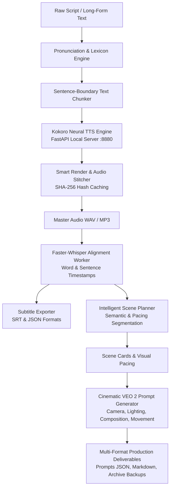

# UnfoldIQ TTS Studio & AI Video Production Workstation

<p align="center">
  
  
  
  
  
  
</p>

---

## 🌟 Giới thiệu tổng quan / Overview

**UnfoldIQ TTS Studio** là một trạm làm việc âm thanh và tiền kỳ video AI chuyên nghiệp (Professional Audio-to-Video Production Workstation). Dự án tích hợp liền mạch từ khâu xử lý kịch bản thô, tổng hợp giọng đọc nơ-ron cục bộ siêu tốc với **Kokoro TTS**, chuẩn hoá phát âm tuỳ biến, đồng bộ timestamp từ cấp độ từ chính xác bằng **Faster-Whisper**, phân đoạn cảnh thông minh (**Intelligent Scene Planner**), dựng trước âm thanh tức thì (**Smart Render Engine**), cho tới tự động tổng hợp prompt điện ảnh chuyên dụng cho các mô hình video thế hệ mới như **Google Veo 2, Sora, Kling và Runway Gen-3**.

---

## 📐 Kiến trúc hệ thống / Architecture Pipeline



---

## ✨ Tính năng nổi bật / Key Features

### 1. 🎙️ High-Performance Kokoro Neural TTS Engine
- Tích hợp động cơ Kokoro TTS cục bộ, tối ưu hóa chạy trên GPU CUDA với độ trễ phản hồi ban đầu cực thấp (< 350ms).
- Tương thích hoàn toàn với giao thức OpenAI Audio API (`/v1/audio/speech`).
- Hỗ trợ đầy đủ các giọng đọc tự nhiên (mặc định: `af_heart`), kiểm soát tốc độ đọc linh hoạt (`0.5x` đến `2.0x`).

### 2. 📖 Pronunciation & Acronym Lexicon System
- Tự động thay thế từ viết tắt, thuật ngữ công nghệ và danh từ riêng theo từ điển người dùng định nghĩa (`config/pronunciation_dictionary.json`).
- Bảo vệ ranh giới từ vựng (`\b`), hỗ trợ xử lý viết hoa/viết thường và các dạng rút gọn (contractions).
- Cửa sổ kiểm tra phát âm tương tác trực tiếp trên giao diện workstation.

### 3. ⏱️ Faster-Whisper Word-Level Timestamp Alignment
- Tích hợp tiến trình phụ (Isolated Subprocess Worker) chạy Faster-Whisper với bộ nhớ độc lập và khả năng tự giải phóng tài nguyên.
- Tạo nhãn thời gian chi tiết từng từ (Word-level timestamps) và từng câu với độ sai số cực nhỏ.
- Tự động xuất phụ đề chuẩn `.srt` và `.json` sẵn sàng đưa vào các phần mềm dựng phim (Premiere Pro, DaVinci Resolve, CapCut).

### 4. 🎬 Intelligent Scene Planner (Phân đoạn cảnh thông minh)
- Tự động phân chia kịch bản thành các Scene Card theo nhịp điệu người nói và điểm ngắt tự nhiên.
- Ràng buộc thời lượng tối ưu cho các mô hình AI Video (mặc định 6.0 giây/cảnh, khoảng linh hoạt 3.0s – 10.0s).
- Bổ sung chỉ dẫn hình ảnh (Visual Intent), đối tượng trọng tâm, tâm trạng cảnh quay (Mood) và gợi ý hiệu ứng chuyển cảnh (Transitions).

### 5. ⚡ Smart Render & Incremental Generation Cache
- Cơ chế băm nội dung SHA-256 theo từng câu: Khi chỉnh sửa một phân đoạn nhỏ trong kịch bản 20.000 ký tự, hệ thống chỉ sinh lại câu bị sửa mà không render lại toàn bộ âm thanh từ đầu.
- Tự động ghép nối liền mạch các khối âm thanh bằng thuật toán cross-fade mềm mại qua FFmpeg, giảm thời gian chỉnh sửa từ vài chục giây xuống dưới 1 giây.

### 6. 🎥 Google Veo 2 / AI Video Prompt Generator
- Trình tạo prompt video điện ảnh chuyên sâu dành cho Google Veo 2, OpenAI Sora, Kling AI và Runway.
- Chuẩn hóa đầy đủ các yếu tố điện ảnh:
  - **Camera Framing & Angle**: Wide establishing, medium tracking shot, extreme close-up, low-angle drone view...
  - **Camera Movement**: Slow push-in, orbital roll, dynamic tracking, crane jib descent...
  - **Lighting & Palette**: Golden hour, cyberpunk neon, chiaroscuro contrast, volumetric haze...
  - **Atmosphere & Style**: Hyper-detailed photorealistic, documentary cinematic 8K, temporal coherence...
- Hỗ trợ chỉnh sửa inline từng cảnh, tự động lưu lịch sử phiên bản (`veo_prompts_archive_*.json`) và xuất báo cáo Markdown chuyên nghiệp.

### 7. 🖥️ Professional Dark Glassmorphism Workstation UI
- Giao diện Dark Slate hiện đại, công thái học (Ergonomic layout) được thiết kế cho các nhà sáng tạo nội dung và studio chuyên nghiệp.
- Thanh công cụ dính thông minh (Sticky Action Bar), điều khiển phát sóng âm thanh đồng bộ với highlight từng dòng kịch bản.
- Thanh điều hướng workspace 7 tab: **Script Editor**, **Audio Player**, **Timestamp Inspector**, **Scene Planner**, **VEO Prompts**, **Projects Browser**, **Pronunciation Lexicon**.

---

## 📁 Cấu trúc thư mục dự án / Repository Structure

```text
UnfoldIQ/
├── .agents/                     # Rules & Skills cho AI Assistant
├── config/                      # Cấu hình hệ thống
│   ├── app.json                 # Cấu hình cổng, đường dẫn ffmpeg, model Whisper & Scene Planner
│   ├── pronunciation_dictionary.json # Từ điển chuẩn hoá phát âm cá nhân
│   └── user_settings.json       # Tuỳ chọn giao diện người dùng
├── models/                      # Thư mục lưu trữ model trọng số (được gitignore an toàn)
│   └── .gitignore
├── outputs/                     # Thư mục xuất file âm thanh và render cuối cùng
│   └── .gitkeep
├── projects/                    # Thư mục lưu trữ các project kịch bản của người dùng
│   └── .gitkeep
├── runtime/                     # File log runtime và PID quản lý tiến trình
│   └── .gitignore
├── scripts/                     # Scripts điều khiển hạ tầng
│   ├── start-unfoldiq-tts.ps1   # PowerShell launcher an toàn, kiểm tra cổng & dependencies
│   ├── stop-unfoldiq-tts.ps1    # PowerShell shutdown an toàn, giải phóng port & worker
│   └── audit_browser_runner.py  # Trình tự động hoá CDP Audit
├── studio/                      # Backend FastAPI và Giao diện người dùng
│   ├── static/                  # Giao diện Web Workstation (HTML5, Vanilla CSS, JS)
│   │   ├── index.html           # Single Page Workstation UI
│   │   ├── style.css            # Dark Mode Design System
│   │   └── app.js               # Logic điều khiển giao diện & Web Audio API
│   ├── app.py                   # FastAPI Master Server & API Endpoints
│   ├── audio_service.py         # Quản lý giao tiếp Kokoro TTS & audio playback
│   ├── config.py                # Quản lý biến môi trường và nạp file app.json
│   ├── project_manager.py       # Quản lý project, lưu trữ kịch bản & manifest
│   ├── prompt_builder.py        # Xây dựng câu nhắc ngữ cảnh
│   ├── pronunciation_service.py # Xử lý biến đổi phiên âm & viết tắt
│   ├── scene_planner.py         # Thuật toán phân cảnh thông minh
│   ├── smart_render.py          # Render âm thanh gia tăng dựa trên SHA-256
│   ├── text_chunker.py          # Chia câu tôn trọng dấu câu & ngữ pháp
│   ├── transcription_service.py # Giao tiếp với Whisper worker
│   └── veo_prompt_generator.py  # Bộ sinh prompt điện ảnh Veo 2 / Sora / Kling
├── tests/                       # Bộ kiểm thử toàn diện (105 Unit Tests & CDP Browser Tests)
│   ├── browser_phase6_final_audit.py # Test suite kiểm thử tự động toàn diện UI
│   ├── test_scene_planner.py    # Unit test phân cảnh
│   ├── test_smart_render.py     # Unit test smart render
│   ├── test_veo_prompt_generator.py # Unit test bộ sinh prompt Veo
│   └── ...
├── transcription/               # Trình đồng bộ Whisper độc lập
│   ├── aligner.py               # Thuật toán căn chỉnh text với audio
│   ├── srt_writer.py            # Xuất phụ đề SRT chuẩn
│   └── worker.py                # Tiến trình con Faster-Whisper
├── start-unfoldiq-tts.bat       # File Batch khởi động 1-click cho Windows
├── stop-unfoldiq-tts.bat        # File Batch tắt an toàn 1-click cho Windows
├── .gitignore                   # Loại trừ file tạm, models nặng, logs
└── README.md                    # Tài liệu hướng dẫn dự án
```

---

## 🚀 Hướng dẫn cài đặt & Khởi chạy / Getting Started

### Yêu cầu hệ thống (Prerequisites)
- **Hệ điều hành**: Windows 10 / 11 (64-bit).
- **Python**: Phiên bản `3.10` trở lên.
- **GPU**: Khuyến nghị card NVIDIA (CUDA 11.8 / 12.x) với tối thiểu 4GB VRAM để tăng tốc Kokoro TTS và Faster-Whisper.
- **FFmpeg**: Đã cài đặt và có trong biến môi trường `PATH` (hoặc cấu hình đường dẫn cụ thể trong `config/app.json`).

### 1. Khởi động nhanh bằng 1-Click Launcher (Khuyến nghị)
Chỉ cần nhấp đúp vào file:
```cmd
start-unfoldiq-tts.bat
```
Script sẽ tự động:
1. Kiểm tra môi trường ảo Python và thư viện phụ thuộc.
2. Kiểm tra xung đột cổng mạng (Port 8880 cho Kokoro TTS, Port 7860 cho Studio UI).
3. Khởi động Kokoro TTS Server ngầm định.
4. Khởi động UnfoldIQ Studio Workstation.
5. Tự động mở trình duyệt web tại địa chỉ: **`http://127.0.0.1:7860`**.

### 2. Dừng hệ thống an toàn
Khi hoàn tất phiên làm việc, nhấp đúp file:
```cmd
stop-unfoldiq-tts.bat
```
Toàn bộ các tiến trình máy chủ, Whisper worker và các tác vụ nền sẽ được giải phóng an toàn, tránh tình trạng chiếm dụng port hoặc tràn bộ nhớ GPU.

---

## ⚙️ Cấu hình hệ thống / Configuration

Bạn có thể tuỳ chỉnh các tham số tại [config/app.json](file:///D:/Project/UnfoldIQ/config/app.json):

```json
{
  "kokoro_base_url": "http://127.0.0.1:8880",
  "studio_host": "127.0.0.1",
  "studio_port": 7860,
  "chunk_target_chars": 400,
  "chunk_max_chars": 480,
  "default_voice": "af_heart",
  "default_speed": 1.0,
  "transcription": {
    "enabled": true,
    "engine": "faster-whisper",
    "model_path": "models/whisper/small.en",
    "device": "cuda",
    "compute_type": "int8_float16",
    "language": "en",
    "word_timestamps": true
  },
  "scene_planner": {
    "target_duration_seconds": 6.0,
    "min_duration_seconds": 3.0,
    "max_duration_seconds": 10.0,
    "default_aspect_ratio": "16:9",
    "default_preset": "unfoldiq_documentary"
  },
  "veo_prompt_generator": {
    "target_shot_duration_seconds": 6.0,
    "preferred_max_shot_duration_seconds": 8.0,
    "minimum_shot_duration_seconds": 3.0,
    "default_aspect_ratio": "16:9"
  }
}
```

---

## 🧪 Kiểm thử chất lượng / Quality Assurance & Testing

Dự án sở hữu bộ test toàn diện đạt tỷ lệ vượt qua **100%** cả về logic backend lẫn tương tác trực quan người dùng:
- **105+ Unit & Integration Tests**: Bao quát toàn bộ Scene Planner, VEO Generator, Smart Render và Whisper Aligner.
- **CDP Headless & Live Browser Audit**: Sử dụng Chrome DevTools Protocol để đo đạc trực tiếp các chỉ số hiệu năng UI, không phát sinh bất kỳ lỗi Console nào (`0 errors, 0 unhandled rejections`).
- Báo cáo chi tiết xem tại: [UI_UX_CORRECTIVE_AUDIT_REPORT.md](file:///D:/Project/UnfoldIQ/UI_UX_CORRECTIVE_AUDIT_REPORT.md).

Chạy toàn bộ unit test:
```powershell
python -m unittest discover -s tests -v
```

---

## 👤 Tác giả & Giấy phép / Author & License

- **Tác giả (Author)**: Nguyen Huu Tin ([@huutin000](https://github.com/huutin000))
- **Email**: `huutin108@gmail.com`
- **Dự án**: [UnfoldIQ](https://github.com/huutin000/UnfoldIQ)
- **Bản quyền**: Phát triển phục vụ sản xuất nội dung âm thanh và video trí tuệ nhân tạo chuyên nghiệp.
