# KẾ HOẠCH TRIỂN KHAI TÁI THIẾT KẾ UNFOLDIQ WORKSTATION (REVISION 2.1)
## MASTER IMPLEMENTATION PLAN — EXTENDED CONTROLLED EXECUTION ROADMAP

> **Phiên bản:** 2.1.0 (Extended Video Rendering Pipeline Roadmap & Final System Integration Gate)  
> **Căn cứ yêu cầu:** Review chỉ đạo bổ sung kiến trúc video rendering pipeline (`UNFOLDIQ-VIDEO-RENDER-ROADMAP`), kết quả nghiệm thu Phase 1 đạt chuẩn tuyệt đối (**451/451 tests PASSED, 0 failed, 0 skipped**) tại `PHASE_01_FINAL_VERIFICATION_REPORT.md`, và chỉ đạo đồng bộ trạng thái roadmap (`UNFOLDIQ-IMPLEMENTATION-PLAN-R2.1-FINAL-ROADMAP-SYNC-PROMPT.md`).  
> **Trạng thái quy trình:** `PLANNING MODE` — **Chỉ cập nhật kiến trúc và roadmap trong tài liệu; tuyệt đối KHÔNG sửa source code, KHÔNG bắt đầu Phase 2 trong cùng task.**  
> **Ràng buộc cốt lõi:**
> 1. Solo-first (tối ưu cho 1 người sáng tạo, không chịu chi phí complexity của multi-user).
> 2. Local-first & Free-first (0đ chi phí API, chạy 100% trên phần cứng thực tế i5-11400H / 16GB RAM / RTX 3050 4GB VRAM).
> 3. **Bất biến chất lượng Master:** Không hạ độ phân giải 1080p, không nén Master WAV PCM 24kHz/16-bit để đánh đổi hiệu năng. Mọi tối ưu hóa chỉ diễn ra trên working representation (Thumbnail WebP, Proxy 720p).
> 4. Chiến lược rollback source code dựa 100% trên Git checkpoints/tags; `.bak` chỉ dùng cho persistent user project data.
> 5. **Ranh giới Rendering độc lập:** Upstream pipeline chỉ xuất dữ liệu ra `Render Manifest` chuẩn hóa độc lập; FFmpeg là rendering engine đầu tiên; không dùng OpenShot; Remotion chỉ là định hướng nghiên cứu tương lai cho browser preview.
> 6. **Cấu trúc 9 Top-Level Phases & 1 Cổng Nghiệm thu Cuối (Final Quality Gate):** Hệ thống duy trì chính xác 9 Phases cấp cao nhất (Phase 3 gồm 4 subphases tuần tự 3A $\rightarrow$ 3D) và kết thúc bằng Cổng Nghiệm thu Tích hợp Toàn diện (Final System Integration Gate — không phải Phase 10).

---

## MỤC LỤC

1. [Pre-Implementation Gate (Cổng tiền thực thi)](#pre-implementation-gate)
2. [Nguyên tắc Thiết kế, Giới hạn Kiến trúc & Chính sách Cổng Thực thi (Execution Gate Policy)](#nguyên-tắc-thiết-kế--giới-hạn-kiến-trúc)
3. [Phân kỳ Triển khai Chi tiết (Phases 1–9, Final System Gate & Future Horizon)](#phân-kỳ-triển-khai-chi-tiết)
   - [Phase 1: Workflow & Data Foundation (✅ PASS / FINAL — VERIFIED)](#phase-1-workflow--data-foundation)
   - [Phase 2: Dependency Engine, Versioning & Resource Scheduling (⏭ READY TO START — NOT STARTED)](#phase-2-dependency-engine-versioning--resource-scheduling)
   - [Phase 3: Core Workbenches Restructuring (Subphases 3A, 3B, 3C, 3D — NOT STARTED)](#phase-3-core-workbenches-restructuring)
   - [Phase 4: Media, Asset & Export Pipeline (NOT STARTED)](#phase-4-media-asset--export-pipeline)
   - [Phase 5: UI Polish, Component Consolidation & Virtualization (NOT STARTED)](#phase-5-ui-polish-component-consolidation--virtualization)
   - [Phase 6: Responsive & WCAG 2.2 AA-Oriented Accessibility Hardening (NOT STARTED)](#phase-6-responsive--wcag-22-aa-oriented-accessibility-hardening)
   - [Phase 7: Render Manifest & Timeline Compiler (FUTURE / NOT STARTED)](#phase-7-render-manifest--timeline-compiler-future--not-started)
   - [Phase 8: Manifest-Driven FFmpeg Render Engine (FUTURE / NOT STARTED)](#phase-8-manifest-driven-ffmpeg-render-engine-future--not-started)
   - [Phase 9: Automated Render QA & Verification (FUTURE / NOT STARTED)](#phase-9-automated-render-qa--verification-future--not-started)
   - [Final System Integration & Production Validation Gate (FINAL GATE / NOT YET RUN)](#final-system-integration--production-validation-gate-final-quality-gate)
   - [Future Horizon: Web Preview & Timeline Editor (Future Consideration)](#future-horizon-web-preview--timeline-editor-future-consideration)
4. [Sơ đồ Phụ thuộc Phase & Subphase (Execution Dependency Graph)](#sơ-đồ-phụ-thuộc-phase--subphase)
5. [Bảng Ma trận Đối soát Yêu cầu (Requirement Coverage Matrix)](#bảng-ma-trận-đối-soát-yêu-cầu-requirement-180-coverage-matrix)
6. [Chiến lược Rollback & Di chuyển Dữ liệu](#chiến-lược-rollback--di-chuyển-dữ-liệu)
7. [Kết luận & Tuyên bố Sẵn sàng (Gate Readiness Verdict)](#kết-luận--tuyên-bố-sẵn-sàng)

---

## PRE-IMPLEMENTATION GATE

Trước khi bất kỳ dòng mã nguồn nào của Phase 1 được chỉnh sửa hoặc commit, các bước kiểm định tiền thực thi bắt buộc phải được xác nhận:

### 1. Kết quả Kiểm thử Tự động Nền tảng (Baseline & Regression Evidence)
- **Kiểm định Nền tảng Tiền thực thi Lịch sử (Pre-Implementation Baseline):**
  - Chạy test suite khởi điểm trước khi code Phase 1:
    ```powershell
    $env:PYTHONPATH="."; python -m pytest tests/test_data_foundation.py tests/test_phase15a_hardening.py tests/test_voice_qa.py -v
    ```
  - Kết quả ghi nhận: **43/43 tests PASSED (100%)** trong thời gian 8.38 giây.
- **Kiểm định Toàn diện Hồi quy Hiện tại (Current Phase 1 Regression Suite):**
  - Chạy full regression test suite toàn hệ thống:
    ```powershell
    pytest --tb=short -q
    ```
  - Kết quả nghiệm thu thực tế: **451/451 tests PASSED (100%)** trong thời gian 35.34 giây (bao gồm 25 tests chuyên biệt của Phase 1 trong `tests/test_phase01_verification.py` và `tests/test_data_foundation.py`).

### 2. Thiết lập Checkpoint & Tag trên Git
- Tạo Git tag/branch kiểm định trước khi sửa code:
  - Branch: `feature/master-redesign`
  - Tag: `audit-complete-baseline` (Dựa trên commit clean gần nhất đã đồng bộ `origin/main`).
- Mọi rollback code khi gặp sự cố trong từng Phase sẽ dùng: `git reset --hard <phase-checkpoint-tag>`.

### 3. Sao lưu Dữ liệu Dự án Thử nghiệm (Test Project Backup)
- Thư mục dự án mẫu `projects/2026-09-12_210003_youtube-narration-01` được nhân bản an toàn sang `projects/.backup_2026-09-12_baseline/` trước khi áp dụng adapter.

### 4. Xác nhận & Giải quyết Sai lệch Môi trường Thực tế (Runtime Reconciliation)
Qua rà soát đối chiếu giữa các file audit, làm rõ và chuẩn hóa các thông số runtime thực tế:
- **Python:** Hệ thống dùng Python 64-bit chuẩn. Host runtime là **Python 3.12.10**; môi trường cô lập `transcription/.venv` và `upstream/kokoro-fastapi/.venv` dùng **Python 3.12.14**. Không có xung đột nhị phân.
- **FFmpeg:** Sử dụng bản build tĩnh `ffmpeg version 8.1.1-essentials_build-www.gyan.dev` hỗ trợ đầy đủ `h264_nvenc`, `hevc_nvenc`, `av1_nvenc`, `h264_qsv`, `libx264`, `libx265`, `libmp3lame`.
- **Mô hình Faster-Whisper:** Mô hình cài đặt cục bộ là `base` (CTranslate2 `4.8.2`, `compute_type="int8_float16"`, `device="cuda"`). Đo kiểm VRAM thực tế chiếm **~1.200 MiB**, thời gian chạy file 11 phút mất **22.4 giây**.
- **Mô hình Kokoro:** Kokoro-82M v1.0 (PyTorch `2.8.0+cu126`, CUDA 12.6/13.4). VRAM chiếm **~1.027 MiB**, tốc độ tổng hợp 8 chunks đạt **5.92 giây**.
- **GPU/VRAM:** NVIDIA GeForce RTX 3050 Laptop GPU (4096 MiB GDDR6 VRAM vật lý, khả dụng cho AI ~3.300 MiB).

### 5. Chỉ số Đo lường Cơ sở Hiện tại (Critical Workflow Baseline Metrics)
- `Project Load (Status API)`: Median = **63.22 ms**
- `Single Scene PUT API`: Median = **9.63 ms**
- `Visual Bible V2 Load`: Median = **4.72 ms**
- `Fast Freshness Check (mtime/size)`: Median = **4.5 µs**, p95 = **4.7 µs** (Cold path SHA-256 trên tệp WAV 31.95 MB: **31.883 ms**; Fast metadata cache hit: median **4.5 µs**, giảm trễ ~7,085x).
  > [!NOTE]
  > `(st_mtime_ns, st_size)` chỉ là kỹ thuật tối ưu hóa độ tươi (freshness optimization) để bỏ qua đọc đĩa khi polling. **SHA-256 nội dung hiệu dụng là nguồn sự thật duy nhất** cho cache/dependency identity. Việc khớp metadata không phải là bằng chứng mật mã xác nhận byte dữ liệu không đổi.
- `Whisper STT (665s audio)`: Median = **22.40 s**
- `Final Video Render 1080p (libx264 CPU)`: 100% CPU load, thời gian đo kiểm = **~78.5 s**

---

## NGUYÊN TẮC THIẾT KẾ & GIỚI HẠN KIẾN TRÚC

### 1. Nạp dữ liệu Chọn lọc (Selective / Section-Based Loading)
- Tuyệt đối **không bắt frontend phụ thuộc vào một endpoint nguyên khối duy nhất** nạp toàn bộ dự án (`/v2/state`).
- Mỗi Workbench chỉ nạp đúng phân vùng dữ liệu mà nó chịu trách nhiệm:
  - `Story Workbench`: Gọi `/api/projects/{id}/story` (Script, StoryBeats, Editorial QA).
  - `Voice Workbench`: Gọi `/api/projects/{id}/voice` (Audio Chunks, Word Cues, Voice settings, Pronunciation).
  - `Visual Workbench`: Thiết kế nạp theo working context (chịu tải tốt cho 250–500+ Shots, không phụ thuộc load-all):
    - `GET /api/projects/{id}/visual/summary`: Tổng quan số lượng scenes, shots, trạng thái pipeline.
    - `GET /api/projects/{id}/visual/scenes`: Danh sách Scene siêu nhẹ cho Navigator (không chứa prompt nặng).
    - `GET /api/projects/{id}/visual/scenes/{scene_id}`: Chi tiết một Scene và các Shot trực thuộc.
    - `GET /api/projects/{id}/visual/shots/{shot_id}`: Chi tiết một Shot Card khi được chọn.
    - `GET /api/projects/{id}/visual/bible`: Visual Bible riêng hoặc phân mảnh theo ngữ cảnh.
    - `GET /api/projects/{id}/visual`: Giữ làm aggregate endpoint phục vụ diagnostics/internal use.
  - `Export Workbench`: Gọi `/api/projects/{id}/export/readiness` (Preflight checklist, Render status).

### 2. Nguồn Sự Thật cho Cache & Dependency (Source of Truth Identity)
- Kiểm tra `(st_mtime_ns, st_size)` **chỉ dùng làm Fast Freshness Check** để bỏ qua việc đọc đĩa khi polling trạng thái.
- **SHA-256 / contentHash** của nội dung hiệu dụng (`effective content hash`) bắt buộc là **Source of Truth duy nhất** để xác định cache hit/miss và kích hoạt lan truyền phụ thuộc (DAG Invalidation).

### 3. Ranh giới Trừu tượng hóa Nhà cung cấp AI (Provider Abstraction Boundaries)
- Mã nguồn nghiệp vụ không được gọi trực tiếp hay gắn cứng vào Kokoro hay Whisper.
- Tạo 2 interfaces tối thiểu:
  - `TTSProvider`: `synthesize_chunk(text, voice, speed, options) -> AudioResult` (Kokoro là adapter đầu tiên).
  - `STTProvider`: `transcribe_segment(audio_path, language, options) -> TranscriptResult` (Faster-Whisper là adapter đầu tiên).

### 4. Đồ thị Phụ thuộc Thực thể (Artifact-Level DAG)
- Quản lý phụ thuộc theo đồ thị có hướng không chu trình (DAG) dựa trên Stable ID:
  $$\text{StoryBeat} \xrightarrow{\text{textHash}} \text{AudioChunk} \xrightarrow{\text{cueHash}} \text{SceneTiming} \xrightarrow{\text{shotHash}} \text{ShotCard} \xrightarrow{\text{promptHash}} \text{RenderArtifact}$$
- **Trạng thái 4 tầng (4-Tier Status Model):**
  - Trạng thái cơ sở: `DRAFT`, `NEEDS_REVIEW`, `READY`.
  - Trạng thái phái sinh: `OUTDATED` (Khi đầu vào thượng nguồn thay đổi contentHash).
  - Trạng thái chặn: `BLOCKED` (Khi có blocker chưa xử lý, ví dụ Voice QA FAIL hoặc thiếu tài sản thiết yếu).

### 5. Mô hình Lịch sử & Khóa an toàn (Versioning & Locking)
- `ArtifactRevision`: Lưu trữ các mốc thay đổi có chủ đích (Checkpoints) gồm `revision_id`, `created_at`, `author="solo"`, `snapshot_data`.
- **Autosave không tạo revision.** Autosave chỉ ghi đè vùng đệm làm việc tạm thời (`working state`).
- `is_locked: true`: Áp dụng cho mọi artifact quan trọng (Story Beat, Audio Chunk, Scene Timing, Shot Card, Media Asset). Artifact đã khóa miễn nhiễm với bulk regenerate.

### 6. Điều phối Tài nguyên theo Phân lớp (Resource Class Scheduler)
- Bốn phân lớp tài nguyên với chính sách concurrency chuyên biệt:
  - `CUDA_HEAVY`: Whisper STT, Kokoro bulk generation (Mặc định Concurrency $N = 1$ trên RTX 3050 4GB).
  - `GPU_ENCODER`: FFmpeg NVENC (Mặc định render-job Concurrency $N = 1$).
  - **Chính sách cùng tồn tại (Coexistence Policy):** `CUDA_HEAVY` và `GPU_ENCODER` chỉ được phép kích hoạt đồng thời nếu cơ chế `ResourceGuard` / dynamic memory budget check xác nhận đủ VRAM khả dụng an toàn (không dựa vào một con số tĩnh cứng); nếu không đủ budget, job kết xuất hoặc AI nặng sẽ xếp hàng đợi tuần tự.
  - `CPU_BOUND`: Editorial QA rule check, Concat/Stitch audio, CPU fallback encoding.
  - `IO_BOUND`: Đọc/ghi project files, Export ZIP packaging.

### 7. Kiến trúc Đường ống Kết xuất Video Hoàn chỉnh (End-to-End Rendering Architecture)
- **Luồng sản xuất mục tiêu xuyên suốt (Target Pipeline Flow):**
  $$\begin{matrix}
  \text{Script} & \xrightarrow{\text{TTS}} & \text{Audio} & \xrightarrow{\text{Gate}} & \text{Voice QA} & \xrightarrow{\text{STT}} & \text{Timestamp} \\
  \downarrow & & & & & & \\
  \text{Scene Plan} & \xrightarrow{\text{Context}} & \text{Visual Bible} & \xrightarrow{\text{Prompt}} & \text{Visual/Motion Gen} & \xrightarrow{\text{Package}} & \text{Production Export} \\
  \downarrow & & & & & & \\
  \textbf{Render Manifest} & \xrightarrow{\text{Compile}} & \textbf{FFmpeg Engine} & \xrightarrow{\text{Inspect}} & \textbf{Render QA} & \xrightarrow{\text{Deliver}} & \mathbf{final.mp4}
  \end{matrix}$$
- **Ranh giới Trung gian Độc lập Render Engine (Renderer-Independent Intermediate Manifest):**
  - Upstream pipeline (Story, Voice, Visual, Export) không bao giờ sinh trực tiếp lệnh hay cú pháp FFmpeg CLI.
  - Toàn bộ trạng thái biên tập được chuẩn hóa thành `render-manifest.json` có schema version riêng (`schemaVersion: "1.0.0"`).
  - Kiến trúc này cho phép hoán đổi hoặc bổ sung bất kỳ renderer nào trong tương lai mà không làm ảnh hưởng đến Scene Plan, Timestamps hay Production Export.
- **FFmpeg là Rendering Engine Đầu tiên (First-Party Rendering Engine):**
  - Phiên bản đầu tiên của hệ thống sử dụng FFmpeg làm render engine chính thức (bản build tĩnh 8.1.1 essentials đã tích hợp sẵn trong repo).
  - Khai thác song song bộ mã hóa phần cứng `h264_nvenc` và CPU fallback `libx264`, kết hợp hệ thống Filtergraphs phức hợp (`filter_complex`) để ghép nối, scale/pad, audio ducking và phụ đề.
- **Không sử dụng OpenShot:**
  - OpenShot không nằm trong kiến trúc hiện tại cũng như tương lai của hệ thống, tránh cồng kềnh phụ thuộc bên ngoài và bảo đảm tính scriptable tự động 100%.
- **Remotion — Định hướng Nghiên cứu Tương lai (Future Consideration):**
  - Remotion chỉ được ghi nhận như một giải pháp nghiên cứu trong tương lai nếu người dùng phát sinh nhu cầu Web Preview / Visual Timeline Editor thời gian thực trên trình duyệt; không phải dependency hiện tại.
  - Mọi công cụ Timeline Editor trong tương lai bắt buộc phải thao tác trực tiếp trên cùng một mô hình `render-manifest.json`, không được tạo pipeline render phân mảnh.

### 8. Chính sách Cổng Thực thi (Execution Gate Policy)
Nhằm bảo đảm tính kỷ luật tối cao và loại bỏ hoàn toàn các rủi ro hồi quy (regression risks), toàn bộ lộ trình tuân thủ nghiêm ngặt chuỗi cổng thực thi tuần tự:
$$\begin{matrix}
\text{Phase 1 (PASS/FINAL)} & \rightarrow & \text{Phase 2 (verify/review PASS)} & \rightarrow & \text{Subphase 3A (verify/review PASS)} \\
\downarrow & & & & \\
\text{Subphase 3B (verify/review PASS)} & \rightarrow & \text{Subphase 3C (verify/review PASS)} & \rightarrow & \text{Subphase 3D (verify/review PASS)} \\
\downarrow & & & & \\
\text{Phase 4 (verify/review PASS)} & \rightarrow & \text{Phase 5 (verify/review PASS)} & \rightarrow & \text{Phase 6 (verify/review PASS)} \\
\downarrow & & & & \\
\text{Phase 7 (verify/review PASS)} & \rightarrow & \text{Phase 8 (verify/review PASS)} & \rightarrow & \text{Phase 9 (verify/review PASS)} \\
\downarrow & & & & \\
\multicolumn{5}{c}{\mathbf{Final\ System\ Integration\ \&\ Production\ Validation\ Gate\ (Production\ Ready)}}
\end{matrix}$$

> [!IMPORTANT]
> **Quy tắc Vận hành Cổng Bắt buộc (Execution Gate Rules):**
> 1. **Không thực hiện nhiều top-level phase trong cùng một tác vụ:** Mỗi phase/subphase phải được thực thi trong một chu trình độc lập.
> 2. **Không tự động chuyển phase:** Sau khi hoàn thành code của một phase, bắt buộc dừng lại để nghiệm thu.
> 3. **Chu trình 6 bước cho mỗi Phase/Subphase:**  
>    `(1) Implement đúng scope` $\rightarrow$ `(2) Run unit tests` $\rightarrow$ `(3) Run full regression` $\rightarrow$ `(4) Tạo Implementation Report` $\rightarrow$ `(5) Review Gate` $\rightarrow$ `(6) Đạt PASS mới chuyển sang phase tiếp theo`.
> 4. **Tính tuần tự của Phase 3 (Core Workbenches):** Phase 3 gồm 4 subphases tuần tự (`3A` $\rightarrow$ `3B` $\rightarrow$ `3C` $\rightarrow$ `3D`), tuyệt đối không thực thi song song vì dùng chung App Shell, frontend state và static assets.
> 5. **Tính tuần tự của Rendering Milestone (Phases 7–9):** Phase 7 (Render Manifest) phải PASS trước khi triển khai Phase 8 (FFmpeg Engine); Phase 8 phải PASS trước khi triển khai Phase 9 (Render QA).
> 6. **Cấu trúc 9 Top-Level Phases bất biến:** Tổng số top-level phases của hệ thống là 9. Cổng kiểm định tích hợp cuối cùng (`Final System Integration & Production Validation Gate`) là một Cổng Chất lượng Toàn diện (Final Quality Gate), không phải là Phase 10.

---

## PHÂN KỲ TRIỂN KHAI CHI TIẾT (PHASES 1–9, FINAL SYSTEM GATE & FUTURE HORIZON)

### Lộ trình Tiến độ Tổng thể (Master Roadmap Execution Flow)

```
  Phase 1: Workflow & Data Foundation [✅ PASS / FINAL — VERIFIED]
    │
    ▼
  Phase 2: Dependency Engine, Versioning & Resource Scheduling [⏭ READY TO START — NOT STARTED]
    │
    ▼
  Phase 3: Core Workbenches Restructuring [⏳ NOT STARTED]
    ├── 3A: App Shell + Overview + Story Workbench [Sequential Gate 1]
    ├── 3B: Voice Workbench [Sequential Gate 2]
    ├── 3C: Visual Workbench [Sequential Gate 3]
    └── 3D: Export Workbench UI [Sequential Gate 4]
    │
    ▼
  Phase 4: Media, Asset & Export Pipeline [⏳ NOT STARTED]
    │
    ▼
  Phase 5: UI Polish, Component Consolidation & Virtualization [⏳ NOT STARTED]
    │
    ▼
  Phase 6: Responsive & WCAG 2.2 AA-Oriented Accessibility Hardening [⏳ NOT STARTED]
    │
    ▼
  Phase 7: Render Manifest & Timeline Compiler [🔵 FUTURE / NOT STARTED]
    │
    ▼
  Phase 8: Manifest-Driven FFmpeg Render Engine [🔵 FUTURE / NOT STARTED]
    │
    ▼
  Phase 9: Automated Render QA & Verification [🔵 FUTURE / NOT STARTED]
    │
    ▼
  FINAL SYSTEM INTEGRATION & PRODUCTION VALIDATION GATE [🏁 FINAL QUALITY GATE / NOT YET RUN]
    :
    · · · · · · · · · · · · · · · · · · · · · · · · · · · · · · · · · · · · · · · · · · · · · · ·
    : (Future Consideration)
    ▼
  Future Horizon: Web Preview & Timeline Editor (Remotion / React Timeline)
```

### Bảng Trạng thái Lộ trình Hiện tại (Current Roadmap Status Matrix)

| Phase / Gate | Tên Phân Kỳ | Trạng Thái Quy Trình | Trạng Thái Triển Khai | Căn Cứ / Ghi Chú |
| :--- | :--- | :---: | :---: | :--- |
| **Phase 1** | Workflow & Data Foundation | ✅ **PASS / FINAL** | `VERIFIED` | 451/451 tests PASSED (100%) tại `PHASE_01_FINAL_VERIFICATION_REPORT.md`. |
| **Phase 2** | Dependency Engine, Versioning & Scheduler | ⏭ **READY TO START** | `NOT STARTED` | Đã chốt kiến trúc; sẵn sàng khởi động khi có lệnh. |
| **Phase 3** | Core Workbenches Restructuring | ⏳ **NOT STARTED** | `NOT STARTED` | Gồm 4 subphases tuần tự (3A $\rightarrow$ 3B $\rightarrow$ 3C $\rightarrow$ 3D). |
| ↳ *3A* | *App Shell + Overview + Story* | ⏳ *NOT STARTED* | `NOT STARTED` | Gate 1 của Phase 3. |
| ↳ *3B* | *Voice Workbench* | ⏳ *NOT STARTED* | `NOT STARTED` | Gate 2 của Phase 3 (phụ thuộc 3A). |
| ↳ *3C* | *Visual Workbench* | ⏳ *NOT STARTED* | `NOT STARTED` | Gate 3 của Phase 3 (phụ thuộc 3B). |
| ↳ *3D* | *Export Workbench UI* | ⏳ *NOT STARTED* | `NOT STARTED` | Gate 4 của Phase 3 (phụ thuộc 3C). |
| **Phase 4** | Media, Asset & Export Pipeline | ⏳ **NOT STARTED** | `NOT STARTED` | Thumbnail WebP, Proxy 720p, Asset Registry, Portable Package. |
| **Phase 5** | UI Polish, Consolidation & Virtualization | ⏳ **NOT STARTED** | `NOT STARTED` | 7 primitives, ảo hóa danh sách lớn, Command Palette. |
| **Phase 6** | Responsive & WCAG 2.2 AA-Oriented Accessibility Hardening | ⏳ **NOT STARTED** | `NOT STARTED` | Thích ứng màn hình laptop 768p, kiểm thử tiếp cận 8 bước định hướng WCAG 2.2 AA. |
| **Phase 7** | Render Manifest & Timeline Compiler | 🔵 **FUTURE** | `FUTURE` | Execution Note: NOT STARTED. Manifest trung gian độc lập, độ hạt 141 Shots, 10 Gates. |
| **Phase 8** | Manifest-Driven FFmpeg Render Engine | 🔵 **FUTURE** | `FUTURE` | Execution Note: NOT STARTED. Tái cấu trúc engine FFmpeg hiện hữu, NVENC/CPU fallback. |
| **Phase 9** | Automated Render QA & Verification | 🔵 **FUTURE** | `FUTURE` | Execution Note: NOT STARTED. Kiểm định tự động ffprobe, Hard Gates vs Heuristic Warnings. |
| **Final Gate**| **Final System Integration & Validation Gate** | 🏁 **NOT YET RUN** | `NOT RUN` | **Cổng Nghiệm thu Toàn diện Hệ thống** (Không phải Phase 10). |
| **Horizon** | Web Preview & Timeline Editor | 💡 *CONSIDERATION* | `RESEARCH` | Nghiên cứu tương lai (Remotion / Custom Timeline). |

---

### PHASE 1: WORKFLOW & DATA FOUNDATION (✅ PASS / FINAL — VERIFIED)

- **Trạng thái Nghiệm thu:** `PASS / FINAL`
- **Trạng thái Triển khai:** `VERIFIED`
- **Kết quả Kiểm định Hồi quy Chuẩn tắc:** **451 / 451 tests PASSED (100%)**, 0 failed, 0 skipped, thời gian thực thi 35.34s (chi tiết tại `PHASE_01_FINAL_VERIFICATION_REPORT.md`).
- **Sẵn sàng Chuyển giao:** Sẵn sàng cho Phase 2 (`READY FOR PHASE 2`).

#### 1. Objective
Xây dựng nền tảng dữ liệu thực thể thống nhất với Stable IDs, thiết kế bộ API nạp dữ liệu chọn lọc (Selective Loading), thiết lập Provider Boundaries tối thiểu cho TTS/STT, chuẩn hóa Fast Freshness Check, và xác nhận tính tương thích ngược trong phạm vi dự án mẫu baseline và các bộ dữ liệu thử nghiệm (không phát hiện mất mát dữ liệu ngữ nghĩa trong phạm vi kiểm chứng).

#### 2. Why
- Ngăn chặn tình trạng giao diện phụ thuộc vào việc tải nguyên khối toàn bộ dự án làm chậm thời gian phản hồi.
- Tách rời hoàn toàn nghiệp vụ khỏi các adapter Kokoro/Whisper cụ thể, tạo tiền đề nâng cấp mở rộng.

#### 3. Scope
- Hoàn thiện Domain Models (`studio/domain_models.py`): Định danh `schemaVersion="2.0.0"`, bổ sung các trường stable IDs (`beat_id`, `chunk_id`, `scene_id`, `shot_id`, `asset_id`).
- Xây dựng Provider Interfaces tối thiểu: `studio/providers/base.py` (`TTSProvider`, `STTProvider`) và adapter bọc `KokoroTTSProvider`, `WhisperSTTProvider`.
- Xây dựng các endpoint nạp chọn lọc:
  - `GET /api/projects/{id}/story`: Kịch bản và nhịp phân đoạn.
  - `GET /api/projects/{id}/voice`: Phân đoạn âm thanh và giọng đọc.
  - Visual working context endpoints (không bắt UI load-all, tối ưu cho dự án 250–500+ Shots):
    - `GET /api/projects/{id}/visual/summary`: Tổng quan tiến độ, số lượng cảnh/shot.
    - `GET /api/projects/{id}/visual/scenes`: Danh sách cảnh rút gọn cho Navigator (không tải prompt nặng).
    - `GET /api/projects/{id}/visual/scenes/{scene_id}`: Chi tiết cảnh và danh sách Shots trực thuộc.
    - `GET /api/projects/{id}/visual/shots/{shot_id}`: Chi tiết một Shot Card khi người dùng click xem.
    - `GET /api/projects/{id}/visual/bible`: Dữ liệu Visual Bible riêng biệt.
    - `GET /api/projects/{id}/visual`: Aggregate diagnostics endpoint (tùy chọn nội bộ).
  - `GET /api/projects/{id}/v2/overview`: Overview slice cho App Shell (định dạng canonical thống nhất).
- Khẳng định `(mtime_ns, size)` chỉ dùng cho Fast Freshness Check; SHA-256 nội dung là khóa định danh cache.
- Cập nhật `ProjectAdapter` hỗ trợ nạp/lưu từng phân vùng độc lập kèm backup `.bak`.

#### 4. Out of Scope
- Chưa xây dựng đồ thị DAG phức tạp (chuyển sang Phase 2).
- Chưa đụng tới giao diện CSS/HTML (chuyển sang Phase 3).

#### 5. Current → Target
- **Current:** Frontend gọi dàn trải nhiều file JSON; polling băm đĩa liên tục; logic gắn chặt trực tiếp vào hàm Kokoro/Whisper.
- **Target:** API phân vùng chọn lọc (`/story`, `/voice`, `/visual`); polling kiểm tra `mtime/size` median $\approx 4.5\text{ µs}$; provider abstraction chuẩn mực.

#### 6. Affected Files / Modules
- `studio/domain_models.py` (Domain schema V2)
- `studio/providers/base.py` (Provider interfaces mới)
- `studio/providers/kokoro_provider.py` (Adapter bọc Kokoro)
- `studio/providers/whisper_provider.py` (Adapter bọc Whisper)
- `studio/project_adapter.py` (Selective loading & saving)
- `studio/transcription_service.py` (Freshness check & hash separation)
- `studio/app.py` (Đăng ký selective endpoints)

#### 7. Data Model Changes
- Cấu trúc `schemaVersion: "2.0.0"` với các trường bắt buộc có stable IDs:
  ```python
  class StorySlice(BaseModel):
      script_text: str
      beats: List[StoryBeat] = Field(default_factory=list)

  class VoiceSlice(BaseModel):
      voice_id: str
      speed: float
      chunks: List[AudioChunk] = Field(default_factory=list)

  class VisualSlice(BaseModel):
      scenes: List[Scene] = Field(default_factory=list)
      visual_bible: Dict[str, Any] = Field(default_factory=dict)
  ```

#### 8. API Changes
- `GET /api/projects/{dir_name}/v2/overview`: Trả về thông số tổng quan dự án cho App Shell.
- `GET /api/projects/{dir_name}/story`: Trả về dữ liệu kịch bản & nhịp phân đoạn (StoryBeats).
- `GET /api/projects/{dir_name}/voice`: Trả về danh sách audio chunks, word cues, settings.
- Visual Selective Working-Context Endpoints (không bắt frontend load-all, tối ưu cho dự án 250–500+ Shots):
  - `GET /api/projects/{dir_name}/visual/summary`: Tổng quan tiến độ, số lượng scene/shot và entity counts.
  - `GET /api/projects/{dir_name}/visual/scenes`: Danh sách scenes siêu nhẹ cho Navigator (không chứa prompt nặng).
  - `GET /api/projects/{dir_name}/visual/scenes/{scene_id}`: Chi tiết một scene và các shots trực thuộc theo nhu cầu.
  - `GET /api/projects/{dir_name}/visual/shots/{shot_id}`: Chi tiết một shot card khi người dùng chọn xem/sửa prompt.
  - `GET /api/projects/{dir_name}/visual/bible`: Dữ liệu Visual Bible riêng biệt.
  - `GET /api/projects/{dir_name}/visual`: Aggregate diagnostics endpoint nội bộ (tùy chọn, frontend không phụ thuộc).

#### 9. UI Changes
- Chưa thay đổi giao diện trực quan; frontend hiện tại tiếp tục hoạt động bình thường qua các endpoint tương thích cũ cho đến khi từng Workbench được chuyển đổi trong Phase 3.

#### 10. Performance Considerations
- Kích thước payload mạng giảm từ ~1.5 MB (nạp toàn bộ) xuống còn ~50 KB – 150 KB cho từng phân vùng.
- Đĩa cứng NVMe hoàn toàn nhàn rỗi trong suốt quá trình polling trạng thái phụ đề nhờ Fast Freshness Check.

#### 11. Responsive Considerations
- Không ảnh hưởng (Backend API).

#### 12. Accessibility Considerations
- Không ảnh hưởng (Backend API).

#### 13. Tests
- Suite kiểm thử nền tảng và kiểm định Phase 1 chuyên biệt (`tests/test_data_foundation.py` và `tests/test_phase01_verification.py`, tổng cộng 25 tests đã pass).
- Bao phủ: Stable ID invariance qua 6 kịch bản đột biến, Provider abstraction & bypass audit, API selective loading contracts, Contract 1 unknown/legacy field preservation, và Deep Semantic Round-trip Diff (13 nhóm dữ liệu chuẩn).

#### 14. Regression Tests
- Toàn bộ suite hồi quy hệ thống: **451/451 tests PASSED (100%)** trong 35.34 giây.

#### 15. Migration
- Tự động tạo `.bak` khi adapter ghi dữ liệu lần đầu.

#### 16. Rollback
- Git commit checkout về checkpoint `audit-complete-baseline`.

#### 17. Acceptance Criteria (Nghiệm thu Hoàn tất — PASS / FINAL)
- [x] Các endpoint phân vùng và ngữ cảnh (`/v2/overview`, `/story`, `/voice`, `/visual/summary`, `/visual/scenes`, `/visual/scenes/{id}`, `/visual/shots/{id}`, `/visual/bible`) trả về mã 200 với dữ liệu chuẩn hóa của dự án 79 cảnh.
- [x] Selective API contracts sẵn sàng và được xác thực đầy đủ phục vụ Phase 3 Workbench migration. Legacy UI tiếp tục hoạt động bình thường trên các endpoint tương thích cũ cho tới khi Story/Voice/Visual Workbench được chuyển đổi tương ứng trong Phase 3.
- [x] Provider interfaces bọc trọn vẹn Kokoro và Faster-Whisper mà không rò rỉ mã phụ thuộc vào router chính.
- [x] Fast metadata cache hit bằng `(st_mtime_ns, st_size)` đạt độ trễ median $\approx 4.5\text{ µs}$, p95 $\approx 4.7\text{ µs}$ (~7,085x nhanh hơn cold path SHA-256); SHA-256 là source of truth duy nhất cho cache identity.
- [x] Backward compatibility verified within the tested baseline project and defined legacy fixtures. Không phát hiện mất mát dữ liệu ngữ nghĩa trong phạm vi kiểm chứng.
- [x] 100% các bài kiểm thử nền tảng và hồi quy tiếp tục PASS (451/451 tests).

> **Nghiệm thu Thực tế:** Đã nghiệm thu chính thức và PASS 100% tại [`docs/implementation/PHASE_01_FINAL_VERIFICATION_REPORT.md`](file:///d:/Project/UnfoldIQ/docs/implementation/PHASE_01_FINAL_VERIFICATION_REPORT.md) (451/451 tests PASSED, 0 failed, 0 skipped, exit code 0).  
> **Trạng thái Phase 1:** **`PASS / FINAL — VERIFIED`** $\rightarrow$ **Sẵn sàng chuyển giao cho Phase 2 (`READY FOR PHASE 2`).**

---

### PHASE 2: DEPENDENCY ENGINE, VERSIONING & RESOURCE SCHEDULING (⏭ READY TO START — NOT STARTED)

- **Trạng thái Quy trình:** `READY TO START`
- **Trạng thái Triển khai:** `NOT STARTED`
- **Điều kiện Tiên quyết:** Phase 1 PASS / FINAL (Đã thỏa mãn nghiệm thu 451/451 tests).

#### 2.1. Objective
Xây dựng Đồ thị Phụ thuộc Thực thể (Artifact-Level DAG) có cơ chế tính toán lan truyền vi mô, hoàn thiện Mô hình Trạng thái 4 tầng, bổ sung hệ thống Lịch sử Phiên bản thực sự (`ArtifactRevision`), cơ chế khóa an toàn (`is_locked`), công cụ gợi ý Next Best Action theo luật, và Bộ điều phối tài nguyên theo phân lớp (`LocalResourceScheduler`).

#### 2.2. Why
- Ngăn chặn việc sửa một câu nhỏ làm invalidate toàn bộ dự án hoặc chạy lại Whisper 11 phút.
- Ngăn chặn sập VRAM trên GPU 4GB khi nhiều tiến trình kích hoạt đồng thời.
- Đảm bảo autosave không làm rác lịch sử phiên bản.

#### 2.3. Scope
- Xây dựng `studio/dependency_graph.py`: Quản lý đồ thị DAG kết nối các node qua `stable_id` và `content_hash`.
- Xây dựng Mô hình Trạng thái: `DRAFT`, `NEEDS_REVIEW`, `READY`, derived `OUTDATED`, effective `BLOCKED`.
- Xây dựng `studio/version_manager.py`: Tạo `ArtifactRevision`, danh sách checkpoint, restore revision. Phân biệt rõ ranh giới: **Autosave ghi đè working state, không tạo revision**.
- Bổ sung cờ `is_locked` cho: Story Beat, Audio Chunk, Scene Timing, Shot Card, Media Asset.
- Xây dựng Rule-based `NextBestActionService`: Gợi ý hành động tiếp theo dựa trên nút bị `OUTDATED` hoặc `BLOCKED` đầu tiên trong DAG.
- Xây dựng `LocalResourceScheduler` phân loại tài nguyên: `CUDA_HEAVY` (concurrency=1 mặc định), `GPU_ENCODER`, `CPU_BOUND`, `IO_BOUND`.

#### 2.4. Out of Scope
- Chưa vẽ lại giao diện CSS (sẽ làm ở Phase 3).

#### 2.5. Current → Target
- **Current:** Không có đồ thị phụ thuộc thực sự; chạy chồng GPU gây OOM; không có lịch sử phiên bản hay checkpoint phục hồi; không có nút khóa bảo vệ.
- **Target:** DAG phân giải chính xác node bị đổi; scheduler quản lý ngân sách tài nguyên theo phân lớp (CUDA_HEAVY concurrency=1, GPU_ENCODER concurrency=1, coexistence có kiểm tra ResourceGuard); checkpoint khôi phục được; khóa bảo vệ toàn diện.

#### 2.6. Affected Files / Modules
- `studio/dependency_graph.py` (Mới: Đồ thị DAG)
- `studio/version_manager.py` (Mới: Quản lý ArtifactRevision)
- `studio/next_action.py` (Mới: Gợi ý Next Best Action)
- `studio/system_check.py` (Nâng cấp thành LocalResourceScheduler)
- `studio/smart_render.py` (Tích hợp DAG & Lock check)
- `studio/app.py` (Đăng ký endpoints cho DAG, Version, Scheduler)

#### 2.7. Data Model Changes
- Định nghĩa mô hình Revision và Dependency Node:
  ```python
  class ArtifactRevision(BaseModel):
      revision_id: str
      artifact_type: str  # script, audio_chunk, shot, visual_bible
      artifact_id: str
      created_at: str
      content_hash: str
      snapshot_data: Dict[str, Any]
      message: Optional[str] = None
  ```

#### 2.8. API Changes
- `GET /api/projects/{id}/dependencies/graph`: Trả về trạng thái các node trong DAG.
- `GET /api/projects/{id}/next-action`: Trả về hành động gợi ý tiếp theo.
- `GET /api/projects/{id}/history/{artifact_type}/{artifact_id}`: Danh sách revisions.
- `POST /api/projects/{id}/history/{revision_id}/restore`: Khôi phục phiên bản.
- `POST /api/projects/{id}/lock/{artifact_type}/{artifact_id}`: Bật/tắt khóa an toàn.

#### 2.9. UI Changes
- Bổ sung biểu tượng ổ khóa và badge trạng thái 4 tầng trên các API payloads (chuẩn bị cho Phase 3).

#### 2.10. Performance Considerations
- Tính toán DAG chạy trong RAM bằng thuật toán topo sort $< 2\text{ ms}$.
- Concurrency=1 trên CUDA_HEAVY và phân lập GPU_ENCODER bảo vệ GPU khỏi tình trạng OOM trên phần cứng RTX 3050 4GB.

#### 2.11. Responsive Considerations
- Không ảnh hưởng (Logic engine).

#### 2.12. Accessibility Considerations
- Mọi trạng thái trả về từ Next Best Action và Dependency Graph đều có đầy đủ text label và icon descriptor.

#### 2.13. Tests
- Test DAG lan truyền: Sửa 1 text chunk $\rightarrow$ Chỉ node audio chunk đó chuyển `OUTDATED`, 78 nodes khác giữ nguyên `READY`.
- Test Version Manager: Tạo 3 checkpoints $\rightarrow$ Restore checkpoint 2 $\rightarrow$ Xác nhận dữ liệu phục hồi chính xác.
- Test Scheduler: Kích hoạt đồng thời Whisper và Kokoro Bulk $\rightarrow$ Xác nhận Whisper chạy, Kokoro vào hàng đợi `QUEUED`.

#### 2.14. Regression Tests
- Chạy lại test suite Phase 1 + 15A + Voice QA.

#### 2.15. Migration
- Các artifact hiện tại tự động gán trạng thái ban đầu dựa trên tính hợp lệ của file đĩa hiện có.

#### 2.16. Rollback
- Git commit checkout về tag kết thúc Phase 1.

#### 2.17. Acceptance Criteria
- [ ] Sửa 1 câu kịch bản không làm bẩn các câu âm thanh không liên quan trong DAG.
- [ ] 0 lỗi CUDA OOM trong toàn bộ các kịch bản thử nghiệm tải (stress scenarios); các tác vụ tuân thủ đúng ngân sách tài nguyên đã cấu hình; giao diện người dùng duy trì phản hồi mượt mà; đo lường và báo cáo VRAM đỉnh thực tế.
- [ ] Phục hồi revision thành công 100% không làm hỏng tính toàn vẹn của dự án.

---

### PHASE 3: CORE WORKBENCHES RESTRUCTURING

Để đảm bảo an toàn và kiểm định độc lập, Phase 3 được chia thành **4 Subphases độc lập**:

```
  Phase 3: Core Workbenches Restructuring
    ├── Subphase 3A: App Shell, Overview & Story Workbench
    ├── Subphase 3B: Voice Workbench
    ├── Subphase 3C: Visual Workbench
    └── Subphase 3D: Export Workbench UI
```

Mỗi subphase tuân thủ nguyên tắc:
- Áp dụng **Design Tokens** và **Component Primitives** ngay từ lúc xây dựng giao diện.
- Giữ lại các modal xác nhận hành động phá hủy nguy hiểm (Xóa vĩnh viễn, Ghi đè hủy dữ liệu); xóa bỏ toàn bộ các modal che khuất workflow biên tập.

#### Bảng Ánh xạ Bảo toàn Năng lực khi Bỏ Modal (Capability Migration Map)
Xóa bỏ modal che khuất màn hình **không đồng nghĩa với việc xóa bỏ tính năng nghiệp vụ**. Toàn bộ năng lực được di chuyển sang các vị trí trực quan, thuận tiện hơn trong mô hình 3 cột (`Navigator | Workspace | Inspector`):

| Bề mặt Cũ (Old Surface) | Năng lực Nghiệp vụ (Capability) | Bề mặt Mới (New Surface) | Dữ liệu / API được Bảo toàn? |
| :--- | :--- | :--- | :---: |
| `edq-modal` | Kiểm tra quy tắc Editorial QA, cảnh báo câu dài & gợi ý sửa | Story Workbench $\rightarrow$ Cột Inspector (Inline) | Có (`StorySlice`, inline QA checks) |
| `narration-beats-modal` | Phân nhịp kịch bản, quản lý act & nhóm câu | Story Workbench $\rightarrow$ Cột Navigator | Có (`story_beats.json`, `StoryBeat`) |
| `modal-storage-manager` | Quản lý dung lượng đĩa, dọn dẹp cache & sao lưu dự án | Overview Workbench $\rightarrow$ System Drawer | Có (Storage APIs, Quota check) |
| `sp-edit-modal` | Biên tập Scene, chỉnh sửa category & visual objective | Visual Workbench $\rightarrow$ Cột Navigator & Inspector | Có (`scene_plan.json`, `Scene`) |
| `veo-edit-modal` | Chỉnh sửa Prompt Veo, Negative Prompt, Camera Motion | Visual Workbench $\rightarrow$ Thẻ Shot Cards tại Workspace | Có (`veo_prompts.json`, `Shot`) |
| `visual-bible-modal` | Tra cứu thực thể nhân vật, bối cảnh & kiểm tra continuity | Visual Workbench $\rightarrow$ Cột Inspector | Có (`visual_bible.json`, `VisualBibleV2`) |

---

#### SUBPHASE 3A: APP SHELL, OVERVIEW & STORY WORKBENCH

##### 1. Objective
Tái cấu trúc khung App Shell chính với thanh Top Stepper 5 Workbench, thanh Global Transport ở đáy, xây dựng Overview Workbench và Story Workbench theo mô hình 3 cột (`Navigator | Workspace | Inspector`).

##### 2. Scope
- Xây dựng App Shell mới trong `studio/static/index.html`: Header cố định, 5 nút Workbench, Transport bar đáy.
- Xây dựng `Overview Workbench`: Dashboard tổng quan, tình trạng kết nối thiết bị, dung lượng đĩa và Drawer bảo trì hệ thống.
- Xây dựng `Story Workbench`:
  - Navigator: Danh sách Story Beats / Phân đoạn nhịp truyện.
  - Workspace: Trình soạn thảo kịch bản kẹp số dòng, độ giãn dòng chuẩn workstation.
  - Inspector: Bảng thống kê từ/thời lượng và tích hợp **Editorial QA Inline** (Bỏ modal `edq-modal`).
- Loại bỏ các modal: `edq-modal`, `narration-beats-modal`, `modal-storage-manager`.

##### 3. Affected Files
- `studio/static/index.html`, `studio/static/app.js`, `studio/static/uq-shell.css`, `studio/static/uq-components.css`.

##### 4. Tests & Regression
- Kiểm tra soạn thảo kịch bản, chuyển beat, hiển thị cảnh báo câu dài của Editorial QA tại chỗ.
- Kiểm thử hồi quy không làm mất nội dung kịch bản khi chuyển đổi qua lại.

##### 5. Acceptance Criteria
- [ ] Chuyển đổi giữa Overview và Story diễn ra mượt mà, không bị giật layout.
- [ ] Editorial QA hiển thị trực tiếp trong Inspector, nút "Áp dụng sửa câu" hoạt động chính xác.

---

#### SUBPHASE 3B: VOICE WORKBENCH

##### 1. Objective
Hợp nhất toàn bộ phân mảnh âm thanh thành `Voice Workbench`: Tích hợp Audio Player, căn chỉnh Word-level Cues, Voice QA, và Từ điển phát âm tại chỗ.

##### 2. Scope
- Navigator: Danh sách Audio Chunks kèm trạng thái cache, thời lượng, nút ổ khóa `is_locked`, và nút "Sinh lại câu này".
- Workspace: Hiển thị sóng âm/thời gian song song với phụ đề từ-theo-từ. Hỗ trợ `Click-to-Seek` (bấm vào từ để tua âm thanh).
- Inspector: Bộ chọn giọng Kokoro, thanh tốc độ, bảng Voice QA điểm số, và **Từ điển phiên âm nội tuyến (Inline Pronunciation)** kèm trình phát nghe thử từ.
- Xóa bỏ các section độc lập: `ws-audio`, `ws-voice-qa`, `ws-timestamp`, `ws-pronunciation`.

##### 3. Affected Files
- `studio/static/index.html`, `studio/static/app.js`, `studio/static/uq-screens.css`.

##### 4. Tests & Regression
- Kiểm tra quy trình nghe phát hiện từ sai $\rightarrow$ Sửa từ điển tại Inspector $\rightarrow$ Bấm sinh lại câu $\rightarrow$ Xác nhận từ được sửa đúng mà không cần chuyển trang.
- Chạy lại test suite `tests/test_voice_qa.py` đảm bảo logic không đổi.

##### 5. Acceptance Criteria
- [ ] Người dùng hoàn thành toàn bộ chu trình xử lý giọng đọc trên 1 màn hình duy nhất.
- [ ] Nút "Sinh lại câu này" cập nhật đúng 1 chunk âm thanh; đo lường warm/cold p50/p95 chunk regeneration để chốt SLA dựa trên thực nghiệm, không có sự hồi quy hiệu năng so với baseline.

---

#### SUBPHASE 3C: VISUAL WORKBENCH

##### 1. Objective
Hợp nhất Bảng phân cảnh Scene và Thẻ Cảnh quay Shot thành `Visual Workbench`: Nhúng trực tiếp Prompt Veo vào thân thẻ Shot, đưa Visual Bible V2 vào cột Inspector cố định, loại bỏ hoàn toàn các modal che khuất màn hình.

##### 2. Scope
- Navigator: Danh sách 79 Scenes với nhãn phân loại danh mục và khuyến nghị (`VEO` / `STATIC IMAGE`).
- Workspace: Danh sách thẻ Shot chi tiết thuộc Scene đang chọn. Mỗi thẻ tích hợp:
  - Thông số máy quay (`shot_type`, `camera_motion`).
  - Ô Prompt Veo hoàn chỉnh và ô Negative Prompt.
  - Nút sao chép prompt, nút nạp video clip (`Intake Media`), và khung xem trước thumbnail.
- Inspector: **Bảng tra cứu Visual Bible V2 trực tiếp**. Khi người dùng chọn một thẻ Shot Card bất kỳ, Inspector tự động phân giải các thực thể nhân vật, bối cảnh/địa điểm và continuity anchor đã được duyệt mà Shot đó kế thừa từ Visual Bible.
- Xóa bỏ các modal: `sp-edit-modal`, `veo-edit-modal`, `visual-bible-modal`.

##### 3. Affected Files
- `studio/static/index.html`, `studio/static/app.js`, `studio/static/uq-vb.css`.

##### 4. Tests & Regression
- Kiểm tra click duyệt qua các Scene và Shot: Thông tin Visual Bible tại Inspector cập nhật chính xác theo thực thể kế thừa.
- Kiểm thử hồi quy với dữ liệu 141 Shots của dự án mẫu.

##### 5. Acceptance Criteria
- [ ] 0 modal pop-up xuất hiện khi chỉnh sửa Scene hoặc Shot.
- [ ] Thao tác sao chép Prompt và nạp video clip diễn ra ngay trên thân thẻ Shot.

---

#### SUBPHASE 3D: EXPORT WORKBENCH UI

##### 1. Objective
Xây dựng giao diện `Export Workbench` chuyên nghiệp với Thước đo kiểm tra điều kiện xuất bản (Preflight Checklist) tự động, bảng điều khiển kết xuất Master và khu vực tải về từng artifact độc lập.

##### 2. Scope
- Cột trái: Preflight Readiness Checklist (Kiểm tra Master Audio, Timestamps coverage, Visual Bible lock, Media clips intake). Cảnh báo rõ ràng các điểm còn thiếu sót.
- Cột phải:
  - Tùy chọn kết xuất Master (Tự động ưu tiên NVENC hoặc CPU fallback).
  - Nút Primary CTA: "BẮT ĐẦU KẾT XUẤT VIDEO CHÍNH THỨC".
  - Danh mục tải về độc lập các artifact: Master WAV, MP3, SRT, VTT, JSON, và gói ZIP hoàn chỉnh.

##### 3. Affected Files
- `studio/static/index.html`, `studio/static/app.js`.

##### 4. Tests & Regression
- Kiểm tra hiển thị checklist preflight đối với dự án thiếu video clip (trạng thái WARNING) và dự án đủ điều kiện (trạng thái READY).

##### 5. Acceptance Criteria
- [ ] Preflight phát hiện chính xác các blocker xuất bản và hiển thị nút hành động khắc phục trực tiếp.
- [ ] Cho phép tải trực tiếp file SRT và WAV độc lập không bắt buộc phải render video.

---

### PHASE 4: MEDIA, ASSET & EXPORT PIPELINE

#### 4.1. Objective
Tối ưu hóa toàn diện đường ống xử lý media và đóng gói xuất xưởng: Tự động sinh WebP Thumbnail ($256\times 144$) khi nạp asset, xây dựng Asset Registry liên kết đa tầng (Thumbnail / Proxy / Master), thực hiện benchmark đánh giá bộ mã hóa phần cứng `h264_nvenc` so với `libx264`, đóng gói Gói Bàn Giao Di Động (Portable Production Package), và phân định rành mạch chất lượng âm thanh Master vs Muxed Audio.

> [!IMPORTANT]
> **Phân định Ranh giới Sở hữu Rendering (Phase 4 vs Phase 8):**  
> Phase 4 **tuyệt đối không xây dựng kiến trúc render engine mới**. Đường ống kết xuất hiện hữu (`studio/renderer_adapter.py`) được giữ để đảm bảo tương thích ngược, đo kiểm benchmark, và nhận bugfix tối thiểu nếu cần. Kiến trúc kết xuất video chính thức dựa trên Render Manifest độc lập được đảm nhiệm hoàn toàn bởi **Phase 8 (Manifest-driven FFmpeg Render Engine)**.

#### 4.2. Why
- Tránh việc tải ảnh 4K nguyên bản làm tràn bộ nhớ web UI; phục vụ thumbnail WebP nhẹ nhàng và proxy 720p cho giao diện.
- Xác lập cơ sở đo kiểm hiệu năng thực tế giữa GPU NVENC và CPU libx264 trước khi cấu hình engine.
- Đảm bảo gói xuất xưởng đầy đủ 10 thành phần tài nguyên cho các phần mềm dựng phim chuyên nghiệp (Premiere, DaVinci, CapCut).

#### 4.3. Scope
- Xây dựng bộ sinh WebP Thumbnail trong `studio/asset_intake.py` với kích thước chuẩn $256\times 144$, định mức dung lượng (quality/size budget) dự kiến $\approx 15\text{ KB}$ tùy theo độ phức tạp thị giác của ảnh (không coi 15KB là con số cứng bất biến).
- Thiết lập Asset Registry theo dõi quan hệ 3 tầng giữa `thumbnail_path`, `proxy_path` (720p), và `master_path` (nguyên bản).
- Đo kiểm benchmark bộ mã hóa trong `studio/renderer_adapter.py`:
  - Thực hiện benchmark khách quan so sánh chất lượng hình ảnh (SSIM/PSNR) và thời gian thực thi giữa `h264_nvenc` và `libx264` trên phần cứng RTX 3050.
  - Kết quả benchmark là căn cứ để lựa chọn hồ sơ mã hóa tối ưu (`EncoderProfile`), không mặc định gán cứng tham số trước khi đo kiểm.
- **Quy chuẩn Rõ ràng về Âm thanh (Audio Specifications):**
  - `Narration Master`: Luôn là **WAV PCM 16-bit 24kHz Mono** nguyên bản (uncompressed, chất lượng phòng thu, độc lập với container video).
  - `Muxed Video Audio`: Âm thanh được ghép vào container `final.mp4` là **AAC 192 kbps, sampling rate 48 kHz stereo** (hoặc mono theo cấu hình mix của dự án).
- Xây dựng công cụ đóng gói Portable Production Package hỗ trợ 10 thành phần: Master audio WAV, SRT, VTT, Script text/json, Shots CSV/JSON, Visual Bible JSON, Image/Motion Prompts, Asset manifest, Assets media files, và manifest.json. Mặc định xuất bản các phiên bản được chấp nhận (`current accepted versions`).

#### 4.4. Out of Scope
- Không tạo mới render engine hay viết lại toàn diện pipeline kết xuất (chuyển sang Phase 7 và Phase 8).
- Không hỗ trợ codec ProRes độc quyền trả phí trên Windows; chuẩn xuất bản tương thích cao nhất là MP4 H.264 / AAC / WAV PCM.

#### 4.5. Current → Target
- **Current:** Ảnh 4K nạp thẳng vào web; render phụ thuộc vào CLI cũ chưa benchmark; gói export thiếu cấu trúc; lẫn lộn định dạng âm thanh Master và Muxed.
- **Target:** Thumbnail WebP tối ưu dung lượng; quan hệ Asset Registry 3 tầng rõ ràng; benchmark mã hóa có số liệu; gói export portable đầy đủ 10 thành phần; chuẩn Master WAV PCM 24kHz và Muxed AAC 192 kbps 48kHz minh bạch.

#### 4.6. Affected Files / Modules
- `studio/asset_intake.py` (Tạo Thumbnail, Proxy & Asset Registry)
- `studio/renderer_adapter.py` (Benchmarking mã hóa, CPU fallback, duy trì tương thích)
- `studio/production_export.py` (Đóng gói Portable Package 10 thành phần)
- `studio/app.py` (Endpoints phục vụ thumbnail & package download)

#### 4.7. Data Model Changes
- Cập nhật trường `AssetRef` với `thumbnail_path`, `proxy_path`, `master_path`, `media_type`, `checksum`.

#### 4.8. API Changes
- `GET /api/projects/{id}/assets/{asset_id}/thumbnail`: Phục vụ ảnh thu nhỏ WebP.
- `GET /api/projects/{id}/export/portable-package`: Tải về gói ZIP sản xuất di động đầy đủ.

#### 4.9. Tests
- Benchmark kiểm tra chất lượng hình ảnh video đầu ra giữa NVENC và CPU bằng script đo lường SSIM/PSNR.
- Kiểm tra tính đầy đủ của 10 thành phần trong file ZIP Portable Package.

#### 4.10. Regression Tests
- Kiểm tra tính tương thích của file xuất bản cuối cùng trên các trình phát VLC, Windows Media Player, Premiere Pro.

#### 4.11. Acceptance Criteria
- [ ] Ảnh thumbnail WebP ($256\times 144$) được sinh tự động khi nạp media và hiển thị mượt mà trên UI.
- [ ] Chuẩn âm thanh tuân thủ đúng cam kết: Master WAV PCM 24kHz Mono nguyên bản được lưu trữ song song và độc lập; âm thanh muxed trong video MP4 là AAC 192 kbps 48 kHz.
- [ ] Gói Portable Production Package giải nén ra có đầy đủ kịch bản, phụ đề SRT/VTT, bảng phân cảnh CSV và toàn bộ media assets theo các accepted versions.

---

### PHASE 5: UI POLISH, COMPONENT CONSOLIDATION & VIRTUALIZATION

#### 5.1. Objective
Chuẩn hóa toàn bộ giao diện theo 7 linh kiện dùng chung, áp dụng kỹ thuật phân trang ảo (DOM Virtualization / Windowing) bảo toàn khả năng tiếp cận (Accessibility-preserving Virtualization), và tích hợp hộp lệnh nhanh Command Palette (`Ctrl + K`) dựa trên phương pháp đo kiểm baseline có kiểm soát.

#### 5.2. Why
- Duy trì tốc độ cuộn trang 60fps mượt mà trên các dự án quy mô lớn 250–500 shots mà không làm vỡ thứ tự focus của bàn phím hoặc trạng thái chọn thẻ.

#### 5.3. Scope
- Chuẩn hóa 7 linh kiện cốt lõi: `UQ-Workbench-Shell`, `UQ-Shot-Card`, `UQ-Inspector-Entity`, `UQ-Unified-Transport`, `UQ-Media-Grid`, `UQ-Transcript-Cues`, `UQ-Preflight-Checklist`.
- Áp dụng thuật toán DOM Virtualization cho danh sách Scene và Shot dài:
  - Đo lường baseline thời gian render và cuộn danh sách hiện tại.
  - Ngưỡng kích hoạt ảo hóa: Thiết lập **ngưỡng ứng viên khởi điểm (initial candidate threshold) là 30 phần tử**, ngưỡng chính thức cuối cùng sẽ được chốt dựa trên số liệu đo lường thực tế (evidence-based from baseline/profiling). Ảo hóa chỉ được kích hoạt khi chứng minh được lợi ích hiệu năng vượt trội so với render DOM trực tiếp.
  - Bảo toàn tuyệt đối trạng thái chọn (`selection state`), vị trí cuộn, và thứ tự điều hướng bàn phím (`Roving Tabindex`).
- Tích hợp Command Palette (`Ctrl + K`): Tìm kiếm nhanh Cảnh, Shot, và thực thể nhân vật Visual Bible bằng thuật toán fuzzy search nội bộ.

#### 5.4. Out of Scope
- Không tự ý thêm tính năng AI chat hay LLM vào Command Palette; chỉ dùng tìm kiếm mờ nội bộ (Fuzzy search).

#### 5.5. Performance Methodology
- Không dùng con số cảm tính:
  1. Đo lường Baseline p50 và p95 thời gian render và cuộn danh sách 79 scenes hiện tại.
  2. Đo lường sau khi áp dụng Virtualization trên dự án mẫu 250+ shots.
  3. Tiêu chí đạt: `Thời gian render danh sách p95 <= 50ms` và `FPS khi cuộn nhanh >= 55fps`.

#### 5.6. Affected Files / Modules
- `studio/static/app.js` (Virtualization engine & Command Palette)
- `studio/static/uq-components.css` (Style 7 linh kiện chuẩn)

#### 5.7. Tests
- Thử nghiệm điều hướng bàn phím qua danh sách ảo hóa: Phím mũi tên $\downarrow$ cuộn mượt mà từ Shot 1 đến Shot 100 mà không bị mất focus.
- Đo kiểm FPS cuộn trang bằng Chrome DevTools / Performance API.

#### 5.8. Acceptance Criteria
- [ ] Thao tác cuộn trang danh sách lớn đạt chuẩn mượt mà không có hiện tượng giật khung hình ($p95 \le 50\text{ms}$, FPS $\ge 55\text{fps}$).
- [ ] Bấm `Ctrl + K`, gõ tên nhân vật/cảnh và bấm Enter nhảy chính xác đến Cảnh quay tương ứng.

---

### PHASE 6: RESPONSIVE & WCAG 2.2 AA-ORIENTED ACCESSIBILITY HARDENING

#### 6.1. Objective
Hoàn thiện khả năng thích ứng đa thiết bị (Desktop-first, capability-adaptive), xử lý triệt để lỗi xếp chồng dọc trên laptop 768p, và thực thi **WCAG 2.2 AA-Oriented Accessibility Hardening** thông qua các cổng kiểm thử tự động và bộ kiểm tra thủ công có kiểm soát.

#### 6.2. Why
- Đảm bảo người sáng tạo nội dung trên mọi loại màn hình (Laptop 1366x768, iPad cảm ứng, màn hình 2K) và người dùng sử dụng bàn phím/screen reader thao tác an toàn, thuận tiện, không bị cản trở bởi lỗi giao diện.

#### 6.3. Scope
- Tái cấu trúc hoàn chỉnh `uq-responsive.css`:
  - Màn hình $\ge 1280\text{px}$: 3 Cột mở rộng (`Nav | Work | Insp`).
  - Màn hình $960\text{px} - 1279\text{px}$ (Laptop 768p): 2 Cột (`Nav | Work`) + Inspector thành Drawer trượt phải.
  - Màn hình $< 960\text{px}$: Workspace chiếm trọn màn hình + 2 Sheets trượt.
- **Tiêu chuẩn Định hướng Tiếp cận WCAG 2.2 AA (Accessibility Hardening):**
  - SC 2.5.8 Target Size (Minimum): Đảm bảo vùng bấm tối thiểu $24\times 24\text{ CSS px}$ cho mọi interactive element; đồng thời áp dụng mục tiêu UX nâng cao $44\times 44\text{px}$ cho màn hình cảm ứng (`pointer: coarse`).
  - SC 1.4.3 Contrast: Nâng màu token `--uq-ink-4` lên `#6b7a90` vượt tỷ lệ tương phản $4.5:1$ trên nền tối.
  - SC 2.4.7 & 2.4.11 Focus: Viền focus `:focus-visible` 2px rõ nét, bẫy focus (Focus Trap) chuẩn cho Drawer và khôi phục focus khi đóng (`Esc`).
  - SC 2.5.7 Dragging Movements: Bắt buộc cung cấp nút bấm thay thế thao tác con trỏ không kéo thả (`Move Up`, `Move Down`) cho mọi tác vụ sắp xếp lại.
  - Non-hover Access: Mọi nút tác vụ luôn có lối tiếp cận không phụ thuộc con trỏ chuột.

#### 6.4. Verification Methodology (Beyond Automated Scanners)
- **Không coi axe/Lighthouse = 0 là bằng chứng duy nhất.**
- Bắt buộc thực hiện checklist kiểm định thủ công 8 bước:
  1. Thao tác hoàn chỉnh quy trình sản xuất chỉ bằng bàn phím (Tab, Shift+Tab, Space, Enter, Arrows).
  2. Kiểm tra thứ tự Focus và viền hiển thị focus trên tất cả các linh kiện.
  3. Mở và đóng Drawer bằng phím `Esc`, xác nhận con trỏ focus quay về đúng nút mở.
  4. Phóng to trình duyệt Zoom 200% ở độ phân giải 1080p: Xác nhận layout tự co về 2-Pane Drawer mà không sinh thanh cuộn ngang trang.
  5. Thử nghiệm Reflow ở chiều rộng 320 CSS px: Xác nhận không có chữ bị cắt cụt hay tràn mép.
  6. Thử nghiệm trên màn hình cảm ứng: Xác nhận không có nút bấm quan trọng nào bị ẩn sau hover.
  7. Sử dụng nút bấm thay thế để đổi thứ tự 2 Cảnh mà không cần kéo thả chuột.
  8. Kiểm tra Screen Reader (NVDA / Windows Narrator) đọc rõ tiến độ thanh render có `aria-live="polite"`.

> [!NOTE]
> **Phạm vi Cam kết Tiếp cận:** Việc hoàn thành checklist kiểm thử thủ công 8 bước cùng các cổng kiểm thử tự động chứng minh sự hoàn thiện của các chốt chặn tiếp cận trọng yếu (Accessibility Hardening), không tuyên bố tương đương với một cuộc kiểm toán tuân thủ chính thức toàn diện toàn bộ hơn 50 tiêu chí thành công Level A/AA của W3C WCAG 2.2.

#### 6.5. Affected Files / Modules
- `studio/static/uq-responsive.css`
- `studio/static/uq-tokens.css`
- `studio/static/app.js`

#### 6.6. Acceptance Criteria
- [ ] Vượt qua 100% checklist kiểm định thủ công 8 bước định hướng WCAG 2.2 AA.
- [ ] Vùng bấm đạt chuẩn tối thiểu $24\times 24\text{px}$ (và $44\times 44\text{px}$ trên pointer coarse); 100% thao tác kéo thả có nút bấm thay thế.
- [ ] Trên màn hình laptop 1366x768, khu vực Workspace kịch bản và thẻ Shot hiển thị hoàn chỉnh không bị tràn dọc.

---

### PHASE 7: RENDER MANIFEST & TIMELINE COMPILER (FUTURE / NOT STARTED)

#### 7.1. Objective
Chuẩn hóa toàn bộ dữ liệu cần thiết để kết xuất video từ `Production Export`, `Scene Plan`, `Timestamps`, `Voice`, `Visual/Motion Assets`, `Background Music`, `Subtitles` thành một tệp manifest trung gian độc lập với render engine (`render-manifest.json`), với độ hạt chi tiết đến từng Cảnh quay (Shot-centric Granularity) và hệ quy chiếu thời gian chính xác theo khung hình (Frame-accurate Timebase).

#### 7.2. Why
- Tách rời hoàn toàn logic biên tập thời gian (Timeline Sequencing & Composition) khỏi cú pháp dòng lệnh hoặc API cụ thể của engine kết xuất.
- Tạo ra một ranh giới dữ liệu ổn định (`Intermediate Representation`): Upstream pipeline (`Story`, `Voice`, `Visual`, `Export`) chỉ cần quan tâm việc biên soạn đúng cấu trúc; downstream render engines (`FFmpeg`, hoặc các engine trong tương lai) chỉ cần đọc manifest để thực thi.
- Bảo toàn đầy đủ độ hạt 141 Shots của dự án mẫu (không làm phẳng hay gộp 141 Shots thành 79 Scenes của visual asset).
- Giúp kiểm thử (Unit test, Validation gate, Mocking) toàn bộ timeline video cực nhanh mà không cần khởi chạy tiến trình render nặng tốn tài nguyên.

#### 7.3. Pipeline Flow
```
Scene Plan (79 Scenes, 141 Shots)
  + Timestamps (Word Cues / Speech Boundaries)
  + Visual Assets (Images / Veo Video Clips / Motion)
  + Master Voice (audio.wav PCM 24kHz Mono)
  + Background Music (Music Track & Volume, Optional)
  + Subtitles / Captions (timestamps.srt / vtt, Optional)
  + Output Configuration (1080p, 16:9, 24fps)
         │
         ▼
  [Timeline Compiler]
         │
         ▼
  exports/<exportId>/render-manifest.json (Immutable, Frame-Accurate Intermediate Manifest)
```

#### 7.4. Canonical Path & Immutability
- **Đường dẫn Chuẩn tắc Bất biến:** `projects/<projectId>/exports/<exportId>/render-manifest.json`.
- **Tính Bất biến (Immutability):** Mỗi tệp `render-manifest.json` gắn liền với một `exportId` cụ thể, lưu trữ snapshot biên dịch hoàn chỉnh gồm `schemaVersion`, `sourceHashes`, `manifestHash`, và các tham chiếu tài sản đã được chấp nhận (`acceptedAssetVersion`).
- Tuyệt đối không lưu file manifest dùng chung có thể ghi đè (mutable) tại thư mục gốc của dự án. Không ghi đè lên manifest lịch sử đã dùng để xuất bản deliverable.

#### 7.5. Data Model & Schema Specification (`render-manifest.json`)
Cấu trúc manifest ưu tiên biểu diễn rãnh video theo danh sách clip Cảnh quay (`videoTrack.clips[]`) nhằm bảo đảm năng lực ánh xạ chính xác toàn bộ 141 Shots:
```json
{
  "schemaVersion": "1.0.0",
  "renderManifestVersion": "1.0.0",
  "manifestId": "rm_20260916_001",
  "projectId": "2026-09-12_210003_youtube-narration-01",
  "exportId": "export_001",
  "projectTitle": "Why Human Babies Survived",
  "createdAt": "2026-09-16T15:30:00Z",
  "sourceHashes": {
    "scenePlanHash": "2c2d60575451...",
    "audioHash": "c48b0c07e002...",
    "timestampsHash": "6ee9d3698980...",
    "intakeLedgerHash": "9a8b7c6d5e4f..."
  },
  "manifestHash": "e3b0c44298fc...",
  "timeBase": { "numerator": 24, "denominator": 1 },
  "outputSettings": {
    "resolution": { "width": 1920, "height": 1080 },
    "aspectRatio": "16:9",
    "fps": 24,
    "totalFrames": 15975,
    "expectedDurationSeconds": 665.625,
    "videoCodecTarget": "h264",
    "audioCodecTarget": "aac",
    "audioBitrate": "192k",
    "audioSampleRate": 48000,
    "pixelFormat": "yuv420p"
  },
  "audioTracks": {
    "voiceTrack": {
      "filePath": "audio/audio.wav",
      "format": "wav_pcm_24k_mono",
      "startFrame": 0,
      "durationFrames": 15975,
      "volume": 1.0,
      "isMaster": true
    },
    "musicTrack": {
      "filePath": "assets/audio/ambient_bed_01.mp3",
      "volume": 0.12,
      "ducking": {
        "enabled": true,
        "duckedVolume": 0.04,
        "attackMs": 150,
        "releaseMs": 300
      },
      "fadeInDurationFrames": 48,
      "fadeOutDurationFrames": 72,
      "loop": true
    }
  },
  "subtitlesTrack": {
    "filePath": "audio/timestamps.srt",
    "format": "srt",
    "burnIn": false,
    "fontName": "Inter",
    "fontSize": 24,
    "bottomOffsetPx": 60
  },
  "videoTrack": {
    "clips": [
      {
        "clipId": "clip_sc001_sh01",
        "sceneId": "scene_001",
        "shotId": "shot_001_01",
        "sequenceIndex": 1,
        "startFrame": 0,
        "durationFrames": 96,
        "endFrame": 96,
        "timelineStartSeconds": 0.0,
        "durationSeconds": 4.0,
        "assetId": "ast_scene001_sh01_v01",
        "acceptedAssetVersion": 1,
        "checksum": "a1b2c3d4e5f6...",
        "filePath": "assets/imported/scene_001_shot_01_a1b2c3d4.mp4",
        "mediaType": "VIDEO",
        "sourceResolution": { "width": 1920, "height": 1080 },
        "sourceFps": 24.0,
        "trim": {
          "inFrame": 0,
          "outFrame": 96,
          "speedFactor": 1.0
        },
        "fittingStrategy": "FIT_PAD",
        "backgroundColor": "#0b0f19",
        "transition": {
          "type": "CUT",
          "durationFrames": 0
        }
      }
    ]
  },
  "scenesMetadata": [
    {
      "sceneId": "scene_001",
      "title": "Introduction",
      "shotIds": ["shot_001_01", "shot_001_02"]
    }
  ]
}
```

#### 7.6. Frame-Accurate Timebase & Transition Semantics
- **Hệ Quy Chiếu Thời Gian (Timebase):** Chuẩn hóa theo số nguyên khung hình (Integer Frame Coordinates: `startFrame`, `durationFrames`, `endFrame`) với `timeBase: { numerator: 24, denominator: 1 }` (24fps). Các trường `seconds` chỉ mang tính chất hiển thị phụ trợ.
- **Ngữ nghĩa Chuyển cảnh (Transition Semantics):**
  - Chuyển cảnh `CUT`: `next.startFrame == previous.endFrame` (không có khung hình chồng lấn hay khoảng trống).
  - Chuyển cảnh `CROSSFADE`: Hai clip chồng lấn chính xác $N$ khung hình (`overlap == transition.durationFrames`).
- **Dung sai Thời gian (Tolerance):** Dựa trên độ dài 1 khung hình (`frameTolerance = 1 frame` $\approx 0.04167\text{s}$ ở 24fps) kết hợp dung sai audio timebase, không dùng con số cố định tùy ý cho mọi dự án.

#### 7.7. Automated Validation Gates (Pre-Render Validation Semantics)
Trước khi manifest được bàn giao cho render engine, `TimelineCompiler` thực thi 10 bài kiểm tra nghiêm ngặt:
1. `PATH_SANDBOX_&_PRESENCE`: Mọi đường dẫn trong `filePath` phải là đường dẫn tương đối chuẩn hóa (project-relative normalized path), không được thoát khỏi thư mục gốc dự án (`Path Traversal Guard`), và tệp phải tồn tại vật lý trên đĩa.
2. `ACCEPTED_ASSET_INTEGRITY`: `assetId`, `acceptedAssetVersion`, và `checksum` phải khớp 100% với phiên bản đã được chấp nhận trong `assets/intake_ledger.json`.
3. `UNSUPPORTED_MEDIA_TYPE`: Từ chối các định dạng ngoài allowlist (cho phép: PNG, JPG, WebP, MP4, MOV).
4. `NON_POSITIVE_DURATION`: Chặn mọi clip có `durationFrames <= 0`.
5. `INVALID_TIMESTAMPS`: Phát hiện lỗi nghịch đảo khung hình `startFrame >= endFrame`.
6. `TRANSITION_AWARE_OVERLAPS`: Kiểm tra chồng lấn khung hình có tính đến chuyển cảnh (cho phép chồng lấn đúng số khung hình của transition cấu hình; chặn mọi chồng lấn bất thường ngoài chuyển cảnh).
7. `TIMELINE_GAPS`: Phát hiện khoảng trống hình ảnh không mong muốn giữa các clip liên tiếp ($|\text{prev.endFrame} - \text{curr.startFrame}| > \text{frameTolerance}$).
8. `REQUIRED_MASTER_AUDIO`: Bắt buộc phải có tệp Master Audio (`audio.wav` PCM 24kHz Mono) nguyên bản.
9. `AUDIO_DURATION_ALIGNMENT`: So sánh tổng thời lượng rãnh hình ảnh với Master Audio; báo lỗi nếu lệch vượt quá `frameTolerance`.
10. `OPTIONAL_TRACK_HANDLING`: Nhạc nền (BGM) bị thiếu chỉ phát ra `WARNING` (không block render nếu người dùng không yêu cầu BGM); rãnh phụ đề là tùy chọn (`optional`). Hỗ trợ cơ chế người dùng chủ động duyệt override cho các cảnh báo phi nghiêm trọng nếu chính sách sản phẩm cho phép.

#### 7.8. Scope & Boundary
- **In Scope**:
  - Module `studio/render_manifest.py` định nghĩa Data Schema Pydantic và Serializer.
  - Module `studio/timeline_compiler.py` biên dịch và thực thi 10 Validation Gates.
  - Endpoint `GET /api/projects/{id}/render-manifest` trả về manifest kiểm tra.
- **Out of Scope**:
  - Không gọi tiến trình FFmpeg (chuyển sang Phase 8).
  - Không xây dựng UI timeline editor (chuyển sang Future Horizon).

#### 7.9. Acceptance Criteria
- [ ] `compile_render_manifest(project_dir, export_id)` sinh ra tệp `exports/<export_id>/render-manifest.json` chuẩn hóa, bảo toàn đầy đủ 141 Shots độc lập với cú pháp FFmpeg.
- [ ] 100% các validation gates chặn đứng dữ liệu sai lệch (missing asset, duration <= 0, timeline gap) kèm thông báo blocker rõ ràng, không crash server.

---

### PHASE 8: MANIFEST-DRIVEN FFMPEG RENDER ENGINE (FUTURE / NOT STARTED)

#### 8.1. Objective
Tái cấu trúc và chuẩn hóa năng lực kết xuất FFmpeg hiện hữu thành `Manifest-driven FFmpeg Render Engine`, nhận đầu vào duy nhất là `render-manifest.json` và kết xuất ra video hoàn chỉnh `final.mp4` đạt chuẩn phát sóng 1080p.

#### 8.2. Why
- Cung cấp khả năng kết xuất video master tự động, offline 100%, chi phí 0đ, không phụ thuộc vào bất kỳ dịch vụ đám mây hay phần mềm độc quyền bên ngoài nào.
- Tận dụng tối đa phần cứng NVIDIA RTX 3050 (`h264_nvenc`) dựa trên hồ sơ cấu hình đã được benchmark ở Phase 4, đồng thời duy trì đường lui an toàn (CPU fallback `libx264`) khi VRAM hạn chế.
- Loại bỏ sự trùng lặp kiến trúc bằng cách tái cấu trúc đường ống kết xuất hiện hữu theo ranh giới Renderer Abstraction tiêu chuẩn.

#### 8.3. Implementation Scope
- **1. Xử lý Hình ảnh (Visual Processing)**:
  - *Image Clips*: Biến ảnh tĩnh (PNG, JPG, WebP) thành video clip độ dài chính xác theo số khung hình bằng `-loop 1` kết hợp scale/pad.
  - *Video Clips*: Cắt xén (trim) video clip theo `inFrame` và `outFrame`, conform FPS về 24fps chuẩn.
  - *Fit / Fill Strategy*:
    - `FIT_PAD` (Mặc định): Giữ nguyên tỷ lệ gốc của tài sản, chèn dải viền đen (`#0b0f19`) tinh tế nếu tỷ lệ lệch 16:9 (`force_original_aspect_ratio=decrease,pad=1920:1080:(ow-iw)/2:(oh-ih)/2`).
    - `FILL_CROP`: Phóng to phủ kín khung hình 1920x1080 và crop tâm (`force_original_aspect_ratio=increase,crop=1920:1080`).
  - *Concatenation & Transitions*:
    - Chuyển cảnh tức thì (Cut): Ghép nối tuần tự bằng `concat demuxer` hoặc filtergraph.
    - Chuyển cảnh hòa tan (Crossfade): Sử dụng `xfade` filter với thời lượng cấu hình trong manifest.
- **2. Xử lý Âm thanh (Audio Composition & Mixing)**:
  - *Master Narration Track*: Âm thanh thuyết minh gốc `audio.wav` (PCM 24kHz/16-bit Mono) được đồng bộ nguyên bản, mã hóa sang AAC 192 kbps 48 kHz.
  - *Background Music Track*: Tự động lặp lại (loop) cho đủ thời lượng video nếu có, áp dụng fade in ở đầu và fade out ở cuối theo số khung hình.
  - *Audio Ducking*: Tự động hạ âm lượng nhạc nền trong toàn bộ các đoạn có giọng đọc thuyết minh và hồi phục âm lượng tự nhiên ở các khoảng lặng.
  - *Audio Trimming & Padding*: Đảm bảo rãnh âm thanh tổng thể khớp chính xác với khung hình cuối cùng của video trong phạm vi `frameTolerance`.
- **3. Tích hợp Phụ đề (Subtitle Integration)**:
  - Nhận đầu vào từ `timestamps.srt` đã căn chỉnh từng từ.
  - Hỗ trợ 2 chế độ:
    - *Soft Subtitles (Khuyến nghị)*: Mux luồng phụ đề text SRT trực tiếp vào container MP4 (`-c:s mov_text`).
    - *Hard Subtitles (Burn-in)*: Dùng filter `subtitles=...:force_style='...'` ép phụ đề trực tiếp lên hình ảnh khi người dùng yêu cầu xuất bản video có phụ đề cố định.
- **4. Quy chuẩn Định dạng Đầu ra (Master Deliverable Specs)**:
  - Container: `MP4` (Faststart enabled: `-movflags +faststart` hỗ trợ web streaming mượt mà).
  - Video Codec: H.264 (Hồ sơ mã hóa `nvencProfile` lựa chọn từ kết quả benchmark Phase 4; tự động fallback CPU `libx264` cấu hình tương đương).
  - Audio Codec: `AAC`, bitrate 192 kbps, **sampling rate 48 kHz stereo** (hoặc mono theo cấu hình mix).
  - Phân giải & Tỷ lệ: `1920x1080` (Full HD, 16:9).
  - Frame Rate: `24.0 fps` bất biến.
  - Pixel Format: `yuv420p` tương thích 100% với mọi trình duyệt và thiết bị.

#### 8.4. Runtime Architecture & Reliability Considerations
- **Machine-Readable Progress Reporting**: Kích hoạt cờ `-progress pipe:1` của FFmpeg để đọc dữ liệu tiến độ dạng `key=value` chuẩn hóa (`out_time_us=...`, `frame=...`, `fps=...`, `progress=continue`, `progress=end`), tính toán tiến độ phần trăm ($0\% - 100\%$) và ETA ổn định; stderr của FFmpeg tiếp tục được lưu trữ cho mục đích chẩn đoán sự cố chuyên sâu.
- **Phân loại Sự cố & Chính sách CPU Fallback (Failure & Fallback Policy):**
  - *Lỗi Đặc thù Bộ mã hóa / Phần cứng (Encoder/Hardware Failures):* Gồm lỗi khởi tạo NVENC (`NVENC init failed`), không tìm thấy phần cứng, hoặc tràn VRAM GPU $\rightarrow$ Hệ thống ghi log cảnh báo và kích hoạt **duy nhất 01 lần thử lại tự động bằng CPU fallback (`libx264`)**.
  - *Lỗi Dữ liệu / Đầu vào / Filtergraph (Input/Data/Filter Errors):* Gồm thiếu file asset, lỗi timestamp, lỗi cú pháp filter, hoặc tệp nguồn bị hỏng $\rightarrow$ **Dừng ngay lập tức (FAIL)** và báo cáo nguyên nhân rõ ràng cho người dùng; tuyệt đối **không thử lại bằng CPU** vì lỗi bản chất dữ liệu sẽ tiếp tục thất bại.
- **Xử lý Dự án Quy mô Lớn (Large Project Command Construction):**
  - Tuyệt đối không nhồi toàn bộ tham số 250–500 shots vào một chuỗi CLI nội tuyến duy nhất nhằm tránh lỗi vượt giới hạn chiều dài dòng lệnh Windows (`lpCommandLine` 32,767 ký tự).
  - Sử dụng tệp danh sách concat demuxer (`concat.txt`), tệp kịch bản filtergraph phức hợp (`-filter_complex_script <file>`), và chuẩn hóa trước (staged normalized clips) nếu cần.
  - Không mặc định phân đoạn chia nhỏ render thành nhiều batch trừ khi có bằng chứng đo lường thực tế về bộ nhớ hoặc độ phức tạp của đồ thị filtergraph bắt buộc phải làm.
- **Scratch Directory & Cleanup**: Mọi file tạm được cô lập trong `projects/<id>/renders/.scratch_<job_id>/` và tự động dọn dẹp sạch sẽ sau khi render hoàn tất hoặc gặp lỗi.
- **Resource Scheduler Enforcement**: Render job được xếp vào phân lớp tài nguyên `GPU_ENCODER`, tuân thủ điều phối của `LocalResourceScheduler` (Concurrency $N = 1$).

#### 8.5. Scope & Boundary
- **In Scope**: Module `studio/ffmpeg_engine.py`, tích hợp điều phối tiến trình render từ `render-manifest.json`, xuất video `final.mp4`.
- **Out of Scope**:
  - Tuyệt đối KHÔNG sử dụng OpenShot.
  - Không nhúng logic chỉnh sửa đồ họa GUI vào engine.

#### 8.6. Acceptance Criteria
- [ ] Tiến trình render chạy ngầm không làm đơ giao diện; tiến độ phần trăm và ETA hiển thị mượt mà dựa trên parsing `-progress pipe:1`.
- [ ] Video `final.mp4` xuất ra đạt chuẩn 1080p H.264, âm thanh AAC 192 kbps 48 kHz đồng bộ hoàn hảo với master narration trong phạm vi `frameTolerance`.
- [ ] CPU fallback chỉ kích hoạt đúng khi gặp lỗi NVENC/phần cứng; các lỗi dữ liệu bị chặn đứng và báo cáo trực tiếp không retry vô ích.
- [ ] Dọn dẹp sạch 100% file tạm trong thư mục scratch sau khi hoàn tất.

---

### PHASE 9: AUTOMATED RENDER QA & VERIFICATION (FUTURE / NOT STARTED)

#### 9.1. Objective
Xây dựng Cổng kiểm định Chất lượng Kỹ thuật Tự động (Automated Technical Quality Gate) sử dụng `ffprobe` ngay sau khi tiến trình render kết thúc, phân định rõ ràng giữa Hard Blockers kỹ thuật và Heuristic Warnings theo ngữ cảnh trước khi quyết định trạng thái sẵn sàng của video.

#### 9.2. Why
- Ngăn chặn triệt để tình trạng bàn giao video bị hỏng ngầm (container corrupt, mất tiếng, sai lệch codec, lệch thời lượng) mà người sáng tạo không nhận biết được.
- Đảm bảo các cảnh quay đặc thù (ảnh tĩnh có chủ đích hoặc cảnh chuyển màn đen) không bị các thuật toán cảnh báo heuristic chặn nhầm thành lỗi nghiêm trọng.

#### 9.3. Technical Inspection Criteria: Hard Gates vs Context-Aware Warnings
Module `RenderQAService` tự động phân tích tệp `final.mp4` qua 2 nhóm tiêu chí:

##### A. Tiêu chí Chặn Nghiêm ngặt (Hard Blockers — Bắt buộc PASS)
Bất kỳ vi phạm nào trong nhóm này sẽ khiến kết quả kiểm định là `FAILED` và chặn hoàn toàn việc chuyển trạng thái thành công:
1. `FILE_PRESENCE & SIZE`: Tệp `final.mp4` tồn tại trên đĩa và dung lượng tệp vượt ngưỡng an toàn tối thiểu ($> 100\text{ KB}$).
2. `CONTAINER_PARSEABILITY`: `ffprobe` đọc và giải mã thành công header của container MP4 (không có lỗi `moov atom not found` hoặc corrupt container).
3. `VIDEO_STREAM_VERIFICATION`: Tồn tại đúng video stream chính, codec `h264`, pixel format `yuv420p`, độ phân giải chuẩn $1920\times 1080$, frame rate $24.0\text{ fps}$ ($\pm 0.1\text{ fps}$).
4. `AUDIO_STREAM_VERIFICATION`: Tồn tại audio stream, codec `aac`, bitrate $\ge 128\text{ kbps}$ (mục tiêu 192 kbps), sample rate $48,000\text{ Hz}$.
5. `DURATION_TOLERANCE`: Thời lượng video và audio stream đo được khớp với `expectedDurationSeconds` trong manifest trong khoảng sai số cho phép $|\Delta t| \le \text{frameTolerance}$.
6. `INTEGRITY_SCAN`: Thực hiện quét mẫu hoặc lệnh `ffmpeg -v error -i final.mp4 -f null -` xác nhận 0 lỗi giải mã khung hình (0 decode errors).

##### B. Cảnh báo Heuristic Theo Ngữ Cảnh (Context-Aware Warnings — Không chặn READY)
Các cảnh báo thuộc nhóm này được đối chiếu trực tiếp với manifest; nếu phù hợp với ngữ cảnh, hệ thống ghi nhận vào danh sách `warnings[]` và **vẫn cho phép chuyển trạng thái `READY`**:
1. `FREEZE_DETECTION`: Phát hiện hình ảnh đứng yên kéo dài $\rightarrow$ Nếu clip trong manifest có `mediaType == "IMAGE"`, đây là hành vi hiển thị ảnh tĩnh bình thường, hệ thống ghi nhận thông tin và không báo lỗi.
2. `BLACK_FRAME_DETECTION`: Phát hiện đoạn đen màn hình $\rightarrow$ Nếu trùng khớp với khoảng thời gian chuyển cảnh có chủ đích (Fade-to-Black) hoặc khoảng lặng đầu/cuối được định nghĩa trong manifest, hệ thống chấp nhận là hợp lệ.
3. `SILENCE_ANOMALY`: Phát hiện khoảng lặng bất thường ngoài các khoảng ngắt câu đã định dạng.

#### 9.4. Render State Machine & Lifecycle Wording
Hệ thống phân định rành mạch giữa vòng đời thực thi của tiến trình render (`RenderJob.status`) và mô hình trạng thái sẵn sàng sản xuất của artifact (`Artifact.status`):
- **Vòng đời Tiến trình Render (`RenderJob.status`):**
  $$\text{IDLE} \rightarrow \text{QUEUED} \rightarrow \text{RENDERING} \rightarrow \text{VALIDATING} \rightarrow \begin{cases} \text{READY} \\ \text{FAILED} \\ \text{CANCELLED} \end{cases}$$
- **Ánh xạ sang Trạng thái Artifact (`Artifact.status`):**
  - Khi Job hoàn thành và 100% Hard Gates đạt PASS $\rightarrow$ `Artifact.status = READY` (kèm theo danh sách `warnings[]` nếu có).
  - Khi Job thất bại hoặc bất kỳ Hard Gate nào FAIL $\rightarrow$ `Artifact.status = BLOCKED` hoặc `NEEDS_REVIEW` kèm mã lỗi chẩn đoán có thể khắc phục.
  - Khi upstream thay đổi (ví dụ sửa prompt hoặc audio chunk) $\rightarrow$ `Artifact.status = OUTDATED`.

#### 9.5. Actionable Error Reporting
- Mọi kết quả kiểm định được lưu thành biên bản kỹ thuật số `projects/<id>/renders/final/render_qa_report.json`.
- Khi QA thất bại, giao diện hiển thị bảng chẩn đoán nguyên nhân rõ ràng và nút hành động khắc phục tức thì (ví dụ: "Lỗi giải mã khung hình NVENC $\rightarrow$ Bấm nút để Tự động thử lại bằng CPU Encoder").

#### 9.6. Acceptance Criteria
- [ ] 100% video xuất ra được tự động phân tích bằng `ffprobe` và sinh báo cáo `render_qa_report.json`.
- [ ] Video chỉ đạt trạng thái `READY` khi toàn bộ các tiêu chí Hard Blockers đạt kết quả `PASS`. Cảnh báo heuristic hợp lệ từ clip ảnh tĩnh không làm hỏng trạng thái `READY`.

---

### FINAL SYSTEM INTEGRATION & PRODUCTION VALIDATION GATE (FINAL QUALITY GATE)

> [!IMPORTANT]
> **Định vị Cổng Nghiệm thu Cuối (Final Gate Definition):**  
> Đây là **CỔNG KIỂM ĐỊNH TÍCH HỢP TOÀN DIỆN HỆ THỐNG (FINAL QUALITY GATE)**, **tuyệt đối KHÔNG PHẢI LÀ PHASE 10**. Tổng số top-level phases của lộ trình tái thiết kế UnfoldIQ Workstation **duy trì chính xác 9 Phases**.  
> **Trạng thái hiện tại:** 🏁 **`NOT YET RUN`** (Sẽ kích hoạt sau khi toàn bộ các phase được chọn triển khai hoàn tất).

#### 1. Objective
Sau khi toàn bộ các phase riêng lẻ được triển khai hoàn tất, thực hiện chu trình nghiệm thu xuyên suốt hệ thống (System-wide End-to-End Validation) nhằm xác nhận rằng tất cả các thành phần độc lập thực sự phối hợp đồng bộ và ổn định với nhau từ đầu đến cuối:
$$\text{Story} \xrightarrow{\text{TTS}} \text{Voice} \xrightarrow{\text{Context}} \text{Visual} \xrightarrow{\text{Preflight}} \text{Export} \xrightarrow{\text{Compile}} \text{Render Manifest} \xrightarrow{\text{FFmpeg}} \text{Render Engine} \xrightarrow{\text{ffprobe}} \text{Render QA} \xrightarrow{\text{Deliver}} \mathbf{final.mp4}$$

#### 2. Mandatory Coverage (13 Hạng mục Nghiệm thu Bắt buộc)
1. **Full Canonical Regression:** Chạy toàn bộ test suite từ thư mục gốc của repository (`pytest --tb=short -q`). Bắt buộc: 100% of collected canonical tests PASS; 0 failed; 0 errors; current reference baseline at roadmap-sync time = 451 tests; any future reduction in collected test count must be explicitly explained and reviewed, rather than silently accepted. Báo cáo đầy đủ: Collected, Passed, Failed, Skipped, Warnings, Duration, Exit Code.
2. **Real Project End-to-End Workflow:** Thực thi toàn bộ chu trình sản xuất trên dự án reference thực tế (79 scenes, 141 shots), đi qua tuần tự 5 Workbench đến tệp video xuất bản cuối cùng. Tuyệt đối không giả lập dữ liệu trạng thái.
3. **Data Integrity & Persistence:** Xác thực tính toàn vẹn của Stable IDs, quan hệ phụ thuộc giữa các artifact, tham chiếu tài sản, phiên bản accepted, mã băm nguồn (source hashes), timestamps, và thứ tự scene/shot. Thử nghiệm kịch bản lưu dữ liệu $\rightarrow$ tắt ứng dụng $\rightarrow$ khởi động lại $\rightarrow$ tải lại dự án: Xác nhận không mất mát dữ liệu hoặc lịch sử revision.
4. **Dependency Engine Micro-propagation:** Kiểm tra cơ chế lan truyền vi mô: Sửa đổi 1 `StoryBeat` duy nhất $\rightarrow$ Chỉ có nhánh hạ nguồn trực tiếp chuyển sang `OUTDATED`, không làm invalid toàn bộ dự án hay kích hoạt Whisper 11 phút. Xác minh đồ thị DAG, content hashes, khóa an toàn và gợi ý Next Best Action.
5. **Version / Lock / Restore Validation:** Kiểm thử tạo `ArtifactRevision` $\rightarrow$ chỉnh sửa $\rightarrow$ phục hồi về revision cũ thành công. Thử nghiệm lệnh bulk regenerate trên artifact đã bật `is_locked: true`: Xác nhận không bị ghi đè (artifact bị khóa vẫn được phép chuyển `OUTDATED` khi upstream đổi).
6. **Resource Scheduler & Recovery Validation:** Kiểm tra các tác vụ nặng (Kokoro TTS, Whisper STT, FFmpeg NVENC/CPU) tuân thủ đúng giới hạn phân lớp tài nguyên (`CUDA_HEAVY concurrency=1`, `GPU_ENCODER concurrency=1`, coexistence có kiểm tra ResourceGuard). Đảm bảo 0 lỗi CUDA OOM trong các kịch bản stress test đã định nghĩa; giao diện foreground luôn phản hồi; cơ chế hủy tiến trình (`cancel`) và dọn dẹp thư mục tạm (`scratch cleanup`) hoạt động hoàn hảo.
7. **Browser Workflow Validation:** Kiểm tra toàn bộ 5 Workbench (`Overview`, `Story`, `Voice`, `Visual`, `Export`): Nút Primary CTA luôn truy cập được, trạng thái hiển thị chính xác, Next Best Action gợi ý chuẩn, không có lỗi console JavaScript未bắt, không có stale view sau khi lưu dữ liệu.
8. **Responsive Layout Matrix:** Kiểm tra trên toàn bộ 11 cấu hình hiển thị: $2560\times 1440$, $1920\times 1080$, $1440\times 900$, $1366\times 768$ (laptop 768p), $1280\times 720$, $1024\times 768$, $768\times 1024$ (tablet portrait), $390\times 844$, $360\times 800$, reflow tại $320\text{ CSS px}$, và phóng to trình duyệt zoom 200%. Đảm bảo không sinh thanh cuộn ngang trang ngoài ý muốn, không cắt cụt nút tác vụ, drawer/sheet hoạt động trơn tru.
9. **Accessibility Hardening Gate:** Kiểm định định hướng WCAG 2.2 AA (WCAG 2.2 AA-oriented accessibility validation): Thao tác hoàn chỉnh chu trình chỉ bằng bàn phím, viền hiển thị focus rõ nét, bẫy focus modal/drawer và phục hồi focus bằng phím `Esc`, vùng bấm tối thiểu $24\times 24\text{px}$ (và $44\times 44\text{px}$ trên pointer coarse), cung cấp nút thay thế cho kéo thả, hỗ trợ reduced motion, trạng thái tiến độ đọc rõ qua aria-live. *(Accessibility Scope Note: This gate validates against the defined automated axe-core/Playwright checks and keyboard/focus audit checklist in Phase 6; it must not be described as full formal WCAG 2.2 Level AA conformance unless a full 50+ SC Level A/AA audit is formally executed).*
10. **Portable Export Package Verification:** Xác nhận file ZIP xuất xưởng chứa đầy đủ 10 thành phần accepted artifacts (kịch bản, Master audio WAV PCM 24kHz, phụ đề SRT/VTT, Shots JSON/CSV, Visual Bible, prompts, asset manifest, media files, manifest.json) với checksum khớp 100%, đường dẫn di động, không chứa file rác hay asset lỗi thời.
11. **Render Manifest Verification (Phụ thuộc Phase 7):** Kiểm tra `exports/<exportId>/render-manifest.json` bảo toàn đầy đủ 141 Shots qua `videoTrack.clips[]`, timebase số nguyên khung hình chính xác (24fps), source hashes, accepted asset versions, transition semantics tường minh, và vượt qua 10 Pre-render Validation Gates.
12. **Final Render Deliverable Verification (Phụ thuộc Phase 8):** Kiểm tra tệp `final.mp4` đạt chuẩn phát sóng 1080p 24fps H.264 yuv420p, âm thanh Muxed Audio AAC 192 kbps 48 kHz stereo đồng bộ hoàn hảo với master narration trong phạm vi `frameTolerance`, tiến độ báo cáo mượt mà qua `-progress pipe:1`, CPU fallback kích hoạt đúng khi gặp sự cố NVENC, dọn sạch 100% scratch directory.
13. **Automated Render QA Gate (Phụ thuộc Phase 9):** Tự động phân tích video bằng `ffprobe`, 100% Hard Blockers kỹ thuật đạt PASS, các cảnh báo heuristic không chặn nhầm clip ảnh tĩnh hoặc fade đen có chủ đích, sinh biên bản `render_qa_report.json`.

#### 3. Cấu trúc Bằng chứng Nghiệm thu Tương lai (Future Evidence Directory Structure)
Khi Cổng Nghiệm thu Cuối được kích hoạt thực thi trong tương lai, toàn bộ bằng chứng khách quan sẽ được lưu trữ có cấu trúc:
```
temp/final_system_validation/
├── regression/
│   ├── pytest_full.log
│   └── pytest_summary.json
├── e2e/
│   ├── workflow_results.json
│   └── screenshots/
├── data_integrity/
├── dependency/
├── versions_and_locks/
├── resource_scheduler/
├── browser/
├── responsive/
├── accessibility/
├── export_package/
├── render_manifest/
├── render/
├── render_qa/
└── final_validation_summary.md
```
> [!NOTE]
> Tuyệt đối không tạo bằng chứng giả định (fake evidence) khi Final Gate chưa thực sự được chạy.

#### 4. Biên bản Nghiệm thu Hệ thống (Final Validation Report Contract)
Khi hoàn tất, hệ thống sẽ xuất biên bản chính thức:
`docs/implementation/FINAL_SYSTEM_INTEGRATION_AND_PRODUCTION_VALIDATION_REPORT.md`  
Gồm 16 mục chuẩn tắc: Executive Summary, Phase Completion Matrix, Full Regression, Real Project E2E, Data Integrity, Dependency/Version/Lock, Resource/Recovery, Browser, Responsive, Accessibility, Export Package, Render Manifest, Final Render, Render QA, Known Gaps, Final Verdict.

Phán quyết cuối cùng của hệ thống chỉ có thể là:
- 🟢 **`PRODUCTION READY`** (100% các tiêu chí đạt chuẩn).
- 🟡 **`CONDITIONAL PASS`** (Đạt chuẩn có điều kiện kèm danh sách ngoại lệ được phê duyệt).
- 🔴 **`NOT READY`** (Tồn tại blocker kỹ thuật chưa được xử lý).

---

### FUTURE HORIZON: WEB PREVIEW & TIMELINE EDITOR (FUTURE CONSIDERATION)

#### 1. Định vị & Tầm nhìn
Sau khi hoàn thiện đường ống kết xuất cốt lõi (Phases 1–9), hệ thống có thể mở rộng thêm lớp tương tác dòng thời gian trực quan trên trình duyệt phục vụ người dùng có nhu cầu tinh chỉnh chi tiết trước khi render chính thức.

#### 2. Tiềm năng Nghiên cứu (Research Candidates)
- **Remotion**: Nghiên cứu khả năng sử dụng Remotion cho tính năng xem trước video bằng React trên trình duyệt thời gian thực (Player Preview component).
- **Custom React Timeline**: Hoặc xây dựng một Timeline Canvas/DOM tùy biến nhẹ nhàng, tích hợp sâu vào hệ sinh thái UnfoldIQ mà không gánh nặng thêm dependencies lớn.

#### 3. Các Tính năng Tương lai Dự kiến
- Xem trước dòng thời gian trực tiếp trên trình duyệt (Browser Preview Player).
- Thao tác kéo thả thay thế tài sản hình ảnh/video cho từng cảnh quay (Quick Asset Replacement).
- Tinh chỉnh điểm cắt (Trim In/Out) và thời lượng cảnh quay trực quan bằng thanh kéo timeline.
- Điều chỉnh âm lượng, thanh trượt nhạc nền và điểm chuyển cảnh tức thì.
- Chỉnh sửa nội dung và thời gian xuất hiện của phụ đề trực tiếp trên timeline.
- Can thiệp thủ công (Manual override) các thông số tự động mà vẫn bảo toàn tính toàn vẹn của kịch bản.

#### 4. Ràng buộc Kiến trúc Bắt buộc (Non-Negotiable Architecture Constraints)
1. **Duy nhất một Nguồn Sự thật & Mô hình Biên dịch (Single Source of Truth & Compiler Model):**
   $$\begin{matrix}
   \text{Canonical Production State} \\
   \text{(Scene Plan, Timestamps, Overrides)}
   \end{matrix} \xrightarrow{\text{Compile}} \begin{matrix}
   \text{Immutable Versioned} \\
   \text{render-manifest.json}
   \end{matrix} \xrightarrow{\text{Execute}} \text{FFmpeg Render Engine}$$
   - Web Timeline Editor đọc `render-manifest.json` để phục vụ xem trước (Browser Preview).
   - Khi người dùng chỉnh sửa dòng thời gian trên giao diện, các thay đổi được lưu vào trạng thái ghi đè chuẩn tắc (`TimelineOverrides` / `CompositionTimeline`).
   - Giao diện sau đó gọi `TimelineCompiler` để sinh ra một **tệp manifest phiên bản mới bất biến** (`exports/<new_exportId>/render-manifest.json`).
   - **Tuyệt đối không ghi đè trực tiếp (mutate in-place) lên tệp manifest đã được biên dịch trước đó.**
2. **Không thay thế FFmpeg Render Engine:**
   - Web Preview / Remotion chỉ đóng vai trò hỗ trợ xem trước và tương tác biên tập trên trình duyệt.
   - Quá trình kết xuất Master Final chất lượng cao phát sóng vẫn do Manifest-driven FFmpeg Render Engine (Phase 8) và Render QA (Phase 9) đảm nhiệm thực thi trực tiếp trên phần cứng máy trạm của người dùng.

---

## SƠ ĐỒ PHỤ THUỘC PHASE & SUBPHASE (EXECUTION DEPENDENCY GRAPH)

```mermaid
graph TD
    PRE["Pre-Implementation Gate<br>(Baseline, Git Tag, Backup)"] --> P1["Phase 1: Workflow & Data Foundation<br>(✅ PASS / FINAL — VERIFIED)"]
    
    P1 --> P2["Phase 2: Dependency Engine, Versioning & Scheduler<br>(⏭ READY TO START — NOT STARTED)"]
    
    P2 --> P3A["Subphase 3A: App Shell + Overview + Story<br>(Sequential Gate 1: NOT STARTED)"]
    
    P3A --> P3B["Subphase 3B: Voice Workbench<br>(Sequential Gate 2: NOT STARTED)"]
    
    P3B --> P3C["Subphase 3C: Visual Workbench<br>(Sequential Gate 3: NOT STARTED)"]
    
    P3C --> P3D["Subphase 3D: Export Workbench UI<br>(Sequential Gate 4: NOT STARTED)"]
    
    P3D --> P4["Phase 4: Media, Asset & Export Pipeline<br>(Thumbnails, NVENC Benchmark, Portable Package)"]
    
    P4 --> P5["Phase 5: UI Polish, Consolidation & Virtualization<br>(7 Primitives, 60fps Windowing, Command Palette)"]
    
    P5 --> P6["Phase 6: Responsive & WCAG 2.2 AA-Oriented Hardening<br>(Laptop Drawer, Touch 44px, Manual A11y 8-Steps)"]

    P6 --> P7["Phase 7: Render Manifest & Timeline Compiler<br>(FUTURE / NOT STARTED: Shot-centric Manifest, 10 Gates)"]

    P7 --> P8["Phase 8: Manifest-driven FFmpeg Render Engine<br>(FUTURE / NOT STARTED: 1080p MP4, NVENC/CPU, Machine Progress)"]

    P8 --> P9["Phase 9: Automated Render QA & Verification<br>(FUTURE / NOT STARTED: ffprobe Inspection, Hard Gates vs Warnings)"]

    P9 --> FG["Final System Integration & Production Validation Gate<br>(🏁 FINAL QUALITY GATE: Full Regression, E2E, 0 Failed, NOT Phase 10)"]

    P7 -.-> FH["Future Horizon: Web Preview & Timeline Editor<br>(FUTURE CONSIDERATION: Browser Preview, Immutable Compiler)"]

    style PRE fill:#111826,stroke:#4f8cff,color:#eef3fa
    style P1 fill:#064e3b,stroke:#10b981,color:#eef3fa
    style P2 fill:#1e3a8a,stroke:#3b82f6,color:#eef3fa
    style P3A fill:#16202f,stroke:#2e3d55,color:#eef3fa
    style P3B fill:#16202f,stroke:#2e3d55,color:#eef3fa
    style P3C fill:#16202f,stroke:#2e3d55,color:#eef3fa
    style P3D fill:#16202f,stroke:#2e3d55,color:#eef3fa
    style P4 fill:#16202f,stroke:#2e3d55,color:#eef3fa
    style P5 fill:#16202f,stroke:#2e3d55,color:#eef3fa
    style P6 fill:#16202f,stroke:#2e3d55,color:#eef3fa
    style P7 fill:#1e1b4b,stroke:#a855f7,color:#eef3fa
    style P8 fill:#1e1b4b,stroke:#a855f7,color:#eef3fa
    style P9 fill:#1e1b4b,stroke:#a855f7,color:#eef3fa
    style FG fill:#1e293b,stroke:#f59e0b,stroke-width:2px,color:#fbbf24
    style FH fill:#0f172a,stroke:#64748b,stroke-dasharray: 5 5,color:#94a3b8
```



---

## BẢNG MA TRẬN ĐỐI SOÁT YÊU CẦU (REQUIREMENT 1–80 COVERAGE MATRIX)

Mọi yêu cầu từ 1 đến 80 đều được ánh xạ trực tiếp vào lộ trình kế hoạch triển khai. Trạng thái thực thi được phân định minh bạch theo từng Phase độc lập:

| Nhóm | Số | Tên Yêu Cầu | Roadmap Coverage | Implementation State | Phase Đảm Nhận & Ghi Chú |
| :--- | :---: | :--- | :---: | :---: | :--- |
| **Product** | 1 | Solo-first | **COVERED** | `VERIFIED` | Phase 1: Loại bỏ 100% auth/team complexity (đã nghiệm thu). |
| | 2 | Priorities | **COVERED** | `VERIFIED` | Pre-gate & Phase 1: Tuân thủ đúng thứ tự ưu tiên nền tảng. |
| | 3 | Product role | **COVERED** | `VERIFIED` | Toàn bộ: Định vị công cụ quản lý sản xuất cá nhân. |
| | 4 | Audit hypotheses | **COVERED** | `VERIFIED` | Pre-gate: Đã xác minh bằng mã nguồn và dự án 79 cảnh thực tế. |
| | 5 | Source of truth order | **COVERED** | `VERIFIED` | Pre-gate: Code và runtime thực tế là thước đo tối cao. |
| | 6 | Audit order | **COVERED** | `VERIFIED` | Pre-gate: Hoàn tất toàn bộ chuỗi audit 00–06 trước khi lập plan. |
| | 7 | Merge hypotheses | **COVERED** | `NOT STARTED` | Phase 3: Gom 15 module cũ về 5 Workbench; giữ nguyên nghiệp vụ. |
| | 8 | Restructure policy | **COVERED** | `NOT STARTED` | Phase 3: Tái cấu trúc toàn diện App Shell và UI. |
| | 9 | Menu/module | **COVERED** | `NOT STARTED` | Phase 3: Bỏ menu phân mảnh, tích hợp ngữ cảnh vào 5 Workbench. |
| | 10 | Data/API/schema | **COVERED** | `VERIFIED` | Phase 1: Domain Schema V2 với stable IDs (đã nghiệm thu). |
| | 11 | Compatibility/migration | **COVERED** | `VERIFIED` | Phase 1: ProjectAdapter hỗ trợ tương thích ngược kèm backup `.bak`. |
| | 12 | Automation boundary | **COVERED** | `NOT STARTED` | Phase 2: AI nặng bắt buộc có lệnh rõ ràng từ người dùng. |
| | 13 | Dependency engine | **COVERED** | `NOT STARTED` | Phase 2: Xây dựng đồ thị Artifact-level DAG có lan truyền vi mô. |
| | 14 | Status model | **COVERED** | `NOT STARTED` | Phase 2: Chuẩn hóa 3 base review states (`DRAFT` / `NEEDS_REVIEW` / `READY`) + derived `OUTDATED` + blockers → effective `BLOCKED`. |
| | 15 | Dashboard | **COVERED** | `NOT STARTED` | Subphase 3A: Overview Workbench tinh gọn, theo dõi tiến độ pipeline. |
| | 16 | Top-level IA | **COVERED** | `NOT STARTED` | Subphase 3A: 5 Tab Workbench trên đỉnh (`Overview, Story, Voice, Visual, Export`). |
| | 17 | Version/locking | **COVERED** | `NOT STARTED` | Phase 2: Khóa an toàn `is_locked` cho Story Beat, Audio Chunk, Scene Timing, Shot Card và Media Asset. |
| | 18 | Local regeneration | **COVERED** | `NOT STARTED` | Subphase 3B: Nút "Sinh lại câu này" trên từng Audio Chunk. |
| | 19 | Voice QA | **COVERED** | `NOT STARTED` | Subphase 3B: Tích hợp Voice QA inline vào Inspector của Voice Workbench. |
| | 20 | Timestamp | **COVERED** | `NOT STARTED` | Subphase 3B: Căn chỉnh Word cues trực tiếp dưới trình phát âm thanh. |
| | 21 | Visual Bible | **COVERED** | `NOT STARTED` | Subphase 3C: Tích hợp Visual Bible V2 trực tiếp vào Inspector của Visual Workbench. |
| | 22 | Scene/Shot Workbench | **COVERED** | `NOT STARTED` | Subphase 3C: Cột Navigator chọn Scene, Cột giữa hiển thị danh sách thẻ Shot. |
| | 23 | Veo Prompt | **COVERED** | `NOT STARTED` | Subphase 3C: Nhúng `veo_prompt` và `negative_prompt` trực tiếp vào thẻ Shot. |
| | 24 | Export | **COVERED** | `NOT STARTED` | Subphase 3D: Preflight Checklist tự động và xuất tải artifact độc lập. |
| | 25 | Next Best Action | **COVERED** | `NOT STARTED` | Phase 2: Engine Next Best Action gợi ý bước tiếp theo theo luật DAG. |
| | 26 | No collaboration | **COVERED** | `NOT STARTED` | Toàn bộ: Loại bỏ 100% comment, assignment, permissions. |
| | 27 | History/restore | **COVERED** | `NOT STARTED` | Phase 2: Quản lý `ArtifactRevision` độc lập với autosave. |
| | 28 | Provider abstraction | **COVERED** | `VERIFIED` | Phase 1: Tách interface `TTSProvider` và `STTProvider` (đã nghiệm thu). |
| | 29 | Cost/cache | **COVERED** | `NOT STARTED` | Phase 2: Khóa băm composite cache key bảo đảm 0đ chi phí API. |
| | 30 | Benchmarks | **COVERED** | `NOT STARTED` | Đã phân tích có chọn lọc Runway, ElevenLabs, Descript, LTX, ComfyUI, Premiere. |
| | 31 | Pattern-not-copy | **COVERED** | `NOT STARTED` | Chỉ lấy pattern: Transcript sync, Khóa chunk, Visual elements, DAG cache, Proxy. |
| | 32 | Feature value | **COVERED** | `NOT STARTED` | Từ chối tính năng rác: Không timeline đa rãnh, không lưu take vô hạn. |
| | 33 | Deliverables | **COVERED** | `NOT STARTED` | Kế hoạch Triển khai Master Revision 2.1 phân kỳ có kiểm soát. |
| | 34 | No code in audit | **COVERED** | `VERIFIED` | Giữ nguyên vẹn mã nguồn trong suốt quá trình lập kế hoạch và sửa plan. |
| | 35 | Refactor scope | **COVERED** | `NOT STARTED` | Lộ trình các Phase độc lập, có thể verify và rollback riêng biệt. |
| | 36 | Product DoD | **COVERED** | `NOT STARTED` | Solo creator hoàn thành video 1080p không cần phần mềm phụ trợ. |
| **Performance** | 37 | Performance audit | **COVERED** | `VERIFIED` | Pre-gate: Đã đo kiểm 14 chỉ số hiệu năng thực tế. |
| | 38 | Large project scalability | **COVERED** | `NOT STARTED` | Phase 5: Ảo hóa DOM (Windowing) cho dự án 250–500+ shots. |
| | 39 | Functional simplification | **COVERED** | `NOT STARTED` | Phase 3: Gom các tính năng rời rạc thành submodules nội tuyến. |
| | 40 | Performance regression | **COVERED** | `VERIFIED` | Pre-gate: Thiết lập chỉ số cơ sở và ngưỡng hồi quy cho từng Phase. |
| | 41 | Hardware-aware no quality loss | **COVERED** | `NOT STARTED` | Phase 4: Tách biệt Proxy vs Master; bảo toàn 100% chất lượng 1080p và WAV 24kHz. |
| | 42 | Resource scheduler | **COVERED** | `NOT STARTED` | Phase 2: `LocalResourceScheduler` giới hạn `CUDA_HEAVY concurrency=1`. |
| **UI/UX** | 43 | Usability first | **COVERED** | `NOT STARTED` | Phase 3: Mọi màn hình trả lời tức thì 6 câu hỏi cốt lõi. |
| | 44 | Design system | **COVERED** | `NOT STARTED` | Phase 3: Áp dụng design tokens và linh kiện chuẩn hóa từ đầu. |
| | 45 | Density | **COVERED** | `NOT STARTED` | Phase 3 & 5: Mật độ Workstation compact, thoáng mắt, không khoảng trắng thừa. |
| | 46 | Progressive disclosure | **COVERED** | `NOT STARTED` | Phase 3: Thông tin cốt lõi ở thẻ, thông số chi tiết nằm ở Inspector. |
| | 47 | Workbench pattern | **COVERED** | `NOT STARTED` | Phase 3: Áp dụng nhất quán mô hình 3 cột `Navigator \| Workspace \| Inspector`. |
| | 48 | Navigation | **COVERED** | `NOT STARTED` | Subphase 3A: Top-level 5 Workbench stepper rõ ràng. |
| | 49 | Primary action | **COVERED** | `NOT STARTED` | Phase 3: Mỗi màn hình chỉ có duy nhất 1 Primary CTA nổi bật. |
| | 50 | Contextual actions | **COVERED** | `NOT STARTED` | Subphase 3C: Nút sao chép prompt và nạp video nằm ngay trên thẻ Shot. |
| | 51 | Keyboard accelerator | **COVERED** | `NOT STARTED` | Phase 3 & 6: Hỗ trợ phím tắt `Alt + 1..5`, `Space`, phím mũi tên, `J/K/L`. |
| | 52 | Command palette | **COVERED** | `NOT STARTED` | Phase 5: Hộp lệnh nhanh `Ctrl + K` tìm kiếm Cảnh và thực thể. |
| | 53 | Status visibility | **COVERED** | `NOT STARTED` | Phase 2 & 3: Ngôn ngữ trạng thái 3 yếu tố: Icon + Text + Màu sắc. |
| | 54 | Actionable errors | **COVERED** | `NOT STARTED` | Phase 3: Lỗi luôn đi kèm nguyên nhân và nút bấm khắc phục tại chỗ. |
| | 55 | Loading UX | **COVERED** | `NOT STARTED` | Phase 3 & 5: Skeleton loading, Progress bar tiến trình nền, Toast thông báo. |
| | 56 | Modal rule | **COVERED** | `NOT STARTED` | Phase 3: Bỏ các modal cản trở; chuyển đổi tính năng sang Inspector/Drawer. |
| | 57 | Desktop-first | **COVERED** | `NOT STARTED` | Phase 3 & 6: Tối ưu sâu cho màn hình máy tính 1080p, 2K và laptop 1366x768. |
| | 58 | Accessibility | **COVERED** | `NOT STARTED` | Phase 6: WCAG 2.2 AA-oriented accessibility hardening. |
| | 59 | Motion | **COVERED** | `NOT STARTED` | Phase 3 & 5: Chuyển động 160ms tinh gọn, không animation trang trí nặng. |
| | 60 | Avoid visual noise | **COVERED** | `NOT STARTED` | Phase 3: Loại bỏ hoàn toàn glow, glassmorphism, gradient loè loẹt. |
| | 61 | Visual direction | **COVERED** | `NOT STARTED` | Toàn bộ: Phong cách Industrial Studio Workstation chuyên nghiệp. |
| | 62 | Performance-aware UI | **COVERED** | `NOT STARTED` | Phase 4 & 5: Dùng Thumbnail WebP, ảo hóa DOM, CSS thuần. |
| **Responsive** | 63 | Adaptive layout | **COVERED** | `NOT STARTED` | Phase 6: Thích ứng thông minh theo năng lực thiết bị. |
| | 64 | Responsive workbench | **COVERED** | `NOT STARTED` | Phase 6: Co giãn 3 cột $\rightarrow$ 2 cột Drawer $\rightarrow$ 1 cột Sheet. |
| | 65 | Content breakpoints | **COVERED** | `NOT STARTED` | Phase 6: Ngưỡng thích ứng hướng nội dung (1280px, 960px, 600px). |
| | 66 | Component responsive | **COVERED** | `NOT STARTED` | Phase 6: Thẻ Shot, toolbar, form không bị tràn mép hay cắt cụt chữ. |
| | 67 | Table responsive | **COVERED** | `NOT STARTED` | Phase 6: Bảng dữ liệu tự chuyển thành Card List trên màn hình nhỏ. |
| | 68 | Toolbar responsive | **COVERED** | `NOT STARTED` | Phase 6: Primary CTA luôn hiện diện; nút phụ gom vào menu overflow. |
| | 69 | Typography responsive | **COVERED** | `NOT STARTED` | Phase 6: Không giảm font chữ dưới 11.5px; co padding/margin trước. |
| | 70 | Media responsive | **COVERED** | `NOT STARTED` | Phase 4 & 6: Khung media giữ tỷ lệ chuẩn 16:9, object-fit cover. |
| | 71 | Asset grid responsive | **COVERED** | `NOT STARTED` | Phase 4: CSS Grid tự co giãn `repeat(auto-fill, minmax(180px, 1fr))`. |
| | 72 | Touch support | **COVERED** | `NOT STARTED` | Phase 6: Hit-box tối thiểu 44px trên thiết bị cảm ứng (`pointer: coarse`). |
| | 73 | Hover fallback | **COVERED** | `NOT STARTED` | Phase 6: Mọi nút tác vụ luôn hiển thị trực tiếp hoặc nằm trong menu ngữ cảnh chạm. |
| | 74 | Drag fallback | **COVERED** | `NOT STARTED` | Phase 6: Cung cấp nút `Move Up`, `Move Down` thay thế cho kéo thả. |
| | 75 | Mobile scope | **COVERED** | `NOT STARTED` | Phase 6: Mobile tập trung vào review-first, theo dõi tiến độ, nghe thử. |
| | 76 | Responsive quality gate | **COVERED** | `NOT STARTED` | Phase 6: Đạt 100% tiêu chí trên các cấu hình hiển thị và reflow 320px. |
| **Video Rendering** | 77 | Renderer-independent Manifest | **COVERED** | `FUTURE` | Phase 7: Chuẩn hóa `render-manifest.json` Shot-centric, frame-accurate, 10 Gates. |
| | 78 | FFmpeg Local Render Engine | **COVERED** | `FUTURE` | Phase 8: Manifest-driven FFmpeg Engine, machine-readable progress, NVENC/CPU. |
| | 79 | Automated Render QA | **COVERED** | `FUTURE` | Phase 9: Kiểm định kỹ thuật tự động bằng `ffprobe`, Hard Gates vs Warnings. |
| | 80 | End-to-End Pipeline Delivery | **COVERED** | `FUTURE` | Phases 7–9: Hoàn chỉnh chu trình từ kịch bản đến video deliverable `final.mp4`. |

> [!NOTE]
> **Kết luận Đối soát Yêu cầu:**  
> **80 / 80 requirements mapped/covered by the roadmap. Implementation and verification status remain phase-dependent.**  
> Các yêu cầu thuộc Phase 1 đã hoàn thành kiểm định thực tế được đánh dấu `VERIFIED`. Các yêu cầu thuộc Phase 2–6 được đánh dấu `NOT STARTED`. Các yêu cầu thuộc Phase 7–9 được phân loại là `FUTURE`.

---

## CHIẾN LƯỢC ROLLBACK & DI CHUYỂN DỮ LIỆU

### 1. Chiến lược Rollback Mã nguồn (Source Code Rollback)
- Toàn bộ source code được bảo vệ bằng hệ thống Git Checkpoints:
  - Trước mỗi Phase/Subphase: Tạo tag `pre-phase-X`.
  - Khi hoàn thành và pass toàn bộ tests của Phase: Tạo tag `post-phase-X`.
  - **Lệnh rollback tức thì khi gặp sự cố không thể khắc phục:**
    ```bash
    git reset --hard pre-phase-X
    git clean -fd
    ```
- **Tuyệt đối không dùng file `.bak` để làm cơ chế rollback cho mã nguồn Python/JS.**

### 2. Chiến lược Di chuyển & Bảo vệ Dữ liệu Dự án (Persistent Data Migration)
- Tệp `.bak` được sử dụng duy nhất cho các file dữ liệu dự án của người dùng (`scene_plan.json.bak`, `veo_prompts.json.bak`, `settings.json.bak`).
- Khi `ProjectAdapter` hoặc `SchemaMigrationService` nâng cấp cấu trúc dữ liệu của dự án:
  1. Sao lưu nguyên vẹn file cũ sang `.bak`.
  2. Ghi file mới dưới dạng file tạm thời `.tmp.json`.
  3. Xác thực tính hợp lệ của cú pháp JSON.
  4. Hoán đổi nguyên tử (`replace`) file `.tmp.json` thành file chính thức.
  5. Nếu có lỗi: Xóa file `.tmp.json` và giữ nguyên file gốc.

---

## KẾT LUẬN & TUYÊN BỐ SẴN SÀNG (GATE READINESS VERDICT)

Bản Kế hoạch Triển khai Revision 2.1 đã được đồng bộ hóa toàn diện trạng thái thực tế và xác lập đầy đủ các quy tắc thực thi:
1. **Phase 1 Hoàn Tất Tuyệt Đối (PASS / FINAL):** 451/451 tests PASSED (100%), 0 failed, 0 skipped, verified trên codebase thực tế tại `PHASE_01_FINAL_VERIFICATION_REPORT.md`.
2. **Phase 2 Sẵn Sàng Khởi Động (READY TO START):** Toàn bộ hợp đồng kiến trúc (DAG, 4-tier status, revision/lock, scheduler) đã chuẩn hóa, sẵn sàng bắt đầu khi có lệnh từ người dùng.
3. **Chính Sách Cổng Thực Thi Nghiêm Ngặt (Execution Gate Policy):** Tuân thủ chu trình tuần tự (Phase 2 $\rightarrow$ 3A $\rightarrow$ 3B $\rightarrow$ 3C $\rightarrow$ 3D $\rightarrow$ 4 $\rightarrow$ 5 $\rightarrow$ 6 $\rightarrow$ 7 $\rightarrow$ 8 $\rightarrow$ 9 $\rightarrow$ Final System Gate). Không gộp nhiều phase vào một task code.
4. **Cấu Trúc 9 Top-Level Phases & Cổng Nghiệm Thu Cuối:** Duy trì chính xác 9 Phases. Bổ sung `Final System Integration & Production Validation Gate` (Cổng nghiệm thu toàn diện hệ thống với 13 tiêu chuẩn chất lượng khắt khe, không phải Phase 10).
5. **Ranh Giới Rendering & Manifest:** Shot-centric 141 Shots, timebase số nguyên khung hình 24fps, snapshot bất biến `exports/<exportId>/render-manifest.json`, progress `-progress pipe:1`, CPU fallback có chọn lọc, Hard Gates vs Context-aware Warnings.
6. **Bảo Toàn Mã Nguồn Tuyệt Đối:** ZERO application source code changes trong suốt quá trình hoàn thiện và đồng bộ hóa tài liệu kế hoạch.

---

### PHÁN QUYẾT ĐỒNG BỘ LỘ TRÌNH (FINAL ROADMAP SYNC VERDICT):
# 🟢 PLAN PASS / ROADMAP SYNCHRONIZED

> **Tuyên bố Sẵn sàng Chuyển giao:**  
> - **Phase 1:** ✅ `PASS / FINAL — VERIFIED` (451/451 tests PASSED)  
> - **Phase 2:** ⏭ `READY TO START / NOT STARTED`  
> - **Phases 3–6:** ⏳ `NOT STARTED`  
> - **Phases 7–9:** 🔵 `FUTURE / NOT STARTED`  
> - **Final System Integration Gate:** 🏁 `NOT YET RUN` (Final Quality Gate, không phải Phase 10)  
> - **Kỷ luật vận hành:** Hoàn thành đồng bộ tài liệu và dừng lại tại đây; **tuyệt đối KHÔNG bắt đầu code Phase 2 trong cùng task** cho tới khi người dùng ra lệnh tiếp theo.
